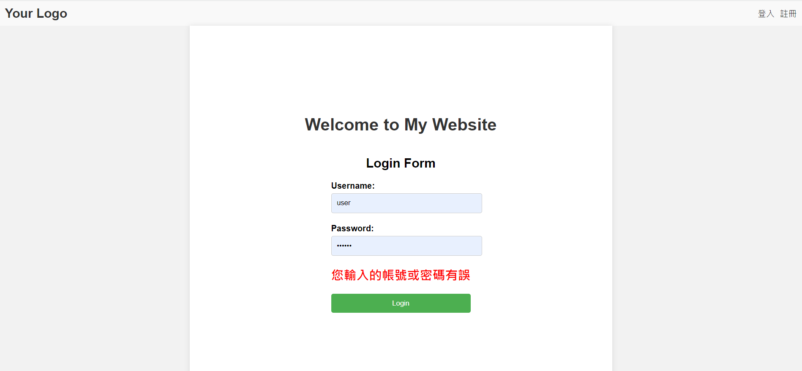

# 登入功能(4)-登入範例
## 前言
前幾天我們已經了解SQLile、flask login了今天就讓我們串起來吧!
[完整程式]()
## 範例
1. appsecret_key(當要使用flask seesion就要設置)
    `app.secret_key` 是 Flask 應用程式的一個設定參數，用於加密 session 和其他安全相關的功能。它是一個字串值，用來提供加密所需的密鑰。

    在 Flask 應用程式中，`app.secret_key` 可以通過設定來指定。這個密鑰應該是一個長度適當且足夠隨機的字串，以確保安全性。密鑰的選擇應該是保密的，不應該公開或分享給他人。
    ```python
    import secrets

    app.secret_key = secrets.token_hex(16)
    ```

    這將生成一個包含 16 個隨機字元的十六進制密鑰。

    設定適當的 `app.secret_key` 對於保護 Flask 應用程式的 session 和其他敏感資訊非常重要，因此請確保保持密鑰的安全性和機密性。
2. login function
    ```python
    @app.route('/login', methods=['GET', 'POST']) #登入
    def login():
        btn_check=None
        if request.method == 'GET':
            return render_template("login.html")


        user_id = request.form['ID']
        user_password = request.form['password']
        db = get_db()
        password = db.execute(
            'SELECT password FROM members WHERE account = ?', (user_id, )
        ).fetchall()
        if not password:
            errorMsg='<span style="color:#35858B"></span><i class="fa fa-exclamation-triangle" aria-hidden="true"></i>您輸入的帳號不存在'
            return render_template('login.html', errorMsg = errorMsg)

        password = password[0][0]
        
        if user_password != password:
            errorMsg='<span style="color:#35858B"></span><i class="fa fa-exclamation-triangle" aria-hidden="true"></i>您輸入的帳號或密碼有誤'
            return render_template('login.html', errorMsg = errorMsg)
        user = User()
        user.id = user_id 
        login_user(user)
        
        return render_template('index.html')
    ```
    首先，使用 `@app.route('/login', methods=['GET', 'POST'])` 裝飾器定義了一個 /login 的路由，該路由支援 GET 和 POST 方法，用於處理登入相關的請求。

    在 GET 請求的情況下，會顯示登入頁面的模板 login.html，並返回給用戶端。

    在 POST 請求的情況下，表示用戶提交了登入表單。從表單中獲取使用者輸入的帳號和密碼，並進行驗證。

    驗證的方式是從資料庫中查詢使用者帳號對應的密碼，並與使用者輸入的密碼進行比對。如果帳號不存在或密碼不正確，則會在登入頁面上顯示相應的錯誤訊息。

    如果驗證通過，則創建一個使用者對象 user，並將使用者的帳號設置為 user.id。接著調用 login_user(user) 函式來登入使用者，這是 Flask-Login 擴展提供的函式，它會將使用者對象存儲在 session 中。

    另外，在 `@app.route('/', methods=['GET', 'POST'])` 的路由中，定義了首頁的處理函式。這裡只是簡單地返回首頁的模板 index.html。

    以上就是這段程式碼的主要功能，它實現了一個簡單的登入系統，並使用了 Flask-Login 擴展來管理使用者的登入狀態。
3. 包裝html
    ```html
    <header>
        <div class="logo">
            Your Logo
        </div>
        <div class="nav">
            
                
                    <a class="nav-link" href="/logout">登出</a></li>
                    <a class="nav-link" href="/manager">管理者</a></li>
                
                    <a class="nav-link" href="/login">登入</a></li>
                    <a class="nav-link" href="/register">註冊</a></li>
                
            
        </div>
    </header>

    ```
    把之前的header額外拉出來寫，並透過的方式引進到其他html接下來，在 <div class="nav"> 標籤中定義了網站的導航列。使用了條件語句  來判斷當前使用者是否已驗證（已登入）。

    如果使用者已驗證，則顯示兩個導航連結，一個是 "登出" 的連結，對應的 URL 是 /logout；另一個是 "管理者" 的連結，對應的 URL 是 /manager。這表示在使用者已登入的情況下，導航列會顯示這兩個選項。

    如果使用者尚未驗證（未登入），則顯示兩個導航連結，一個是 "登入" 的連結，對應的 URL 是 /login；另一個是 "註冊" 的連結，對應的 URL 是 /register。這表示在使用者未登入的情況下，導航列會顯示這兩個選項。
4. html login form
    ```html
    <form action="{{ url_for('login')}}" method="POST">
        <div class="form-group">
            <label for="username">Username:</label>
            <input type="text" id="username" name="ID" required>
        </div>
        <div class="form-group">
            <label for="password">Password:</label>
            <input type="password" id="password" name="password" required>
        </div>
        <h2 style="color:red;"> {{ errorMsg|safe }} </h2>

        <div class="form-group">
            <button type="submit">Login</button>
        </div>
                </form>
    ```
    相信這個大家都很熟就不再多說了
5. css這裡只增加login form的header那些照舊
    ```css
        .container h2 {
            text-align: center;
            margin-bottom: 20px;
        }
        .form-group {
            margin-bottom: 20px;
        }
        .form-group label {
            display: block;
            margin-bottom: 5px;
            font-weight: bold;
        }
        .form-group input {
            width: 100%;
            padding: 10px;
            border: 1px solid #ccc;
            border-radius: 4px;
        }
        .form-group button {
            width: 100%;
            padding: 10px;
            background-color: #4CAF50;
            color: #fff;
            border: none;
            border-radius: 4px;
            cursor: pointer;
        }
        .form-group button:hover {
            background-color: #45a049;
        }

    ```
## 結果
### 不存在db的帳號

### 密碼錯誤

### 登入後


## 總結
登入功能大致上到這裡明天為大家介紹註冊功能。