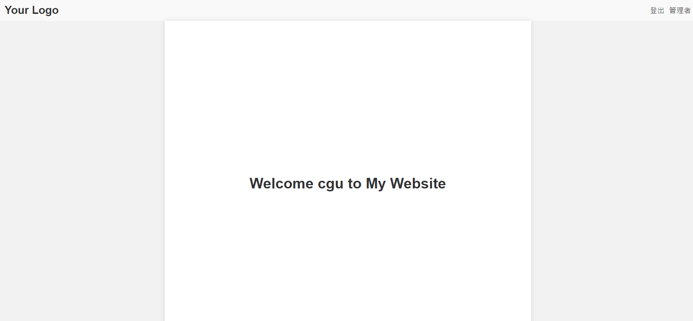

# 登入功能(5)-註冊
## 前言
前幾天我們已經了解如何將SQLite結合flask login達成登入系統，今天就讓我們實現註冊功能吧!
[完整程式]()
## 範例
1. sign up function
    ```python
    @app.route('/signup', methods=['GET', 'POST'])
    def sign_up():
        if request.method == 'GET':
            return render_template('signup.html')

        user_id = request.form['ID']
        user_password = request.form['password']
        check_passowrd= request.form.get('checkpassword')

        if(user_password != check_passowrd):
            errorMsg='<span style="color:#35858B"></span><i class="fa fa-exclamation-triangle" aria-hidden="true"></i>您輸入的密碼有誤'
            return render_template('signup.html', errorMsg = errorMsg)

        db = get_db()

        try:
            with db:
                db.execute (
                    'INSERT INTO members (account, password) VALUES (?, ?)',
                    (user_id, user_password)
                )
        except sqlite3.IntegrityError:
            errorMsg='<span style="color:#35858B"></span><i class="fa fa-exclamation-triangle" aria-hidden="true"></i>該帳號已有人使用'
            return render_template('signup.html', errorMsg = errorMsg)
        user=User()
        user.id=user_id
        login_user(user)
        user_id = current_user.get_id() 
        return render_template('index.html',user_id=user_id)
    ```
    此範例是基於Flask框架的Python應用程式的路由處理函式，用於處理`/signup`路徑的GET和POST請求，接下來讓我一一詳述。

    ```python
    @app.route('/signup', methods=['GET', 'POST'])
    def sign_up():
        if request.method == 'GET':
            return render_template('signup.html')
    ```

    接者使用了`@app.route()`裝飾器，將`/signup`路徑與`sign_up()`函式關聯起來。當收到GET請求時，它會渲染名為`signup.html`的模板並返回給客戶端。

    ```python
        user_id = request.form['ID']
        user_password = request.form['password']
        check_password = request.form.get('checkpassword')
    ```

    這裡使用`request.form`從客戶端POST請求中獲取表單數據。`user_id`表示使用者輸入的ID，`user_password`表示使用者輸入的密碼，`check_password`表示使用者輸入的確認密碼。

    ```python
        if(user_password != check_password):
            errorMsg='<span style="color:#35858B"></span><i class="fa fa-exclamation-triangle" aria-hidden="true"></i>您輸入的密碼有誤'
            return render_template('signup.html', errorMsg=errorMsg)
    ```

    這段程式碼會檢查使用者輸入的密碼和確認密碼是否相符。如果不相符，會生成一個錯誤訊息`errorMsg`，然後將它傳遞給`signup.html`模板進行渲染並返回給客戶端。

    ```python
        db = get_db()
    ```

    這裡調用了`get_db()`函式，用於獲取與資料庫的連接或資料庫實例，`get_db()`在前面的天數有講到。

    ```python
        try:
            with db:
                db.execute (
                    'INSERT INTO members (account, password) VALUES (?, ?)',
                    (user_id, user_password)
                )
        except sqlite3.IntegrityError:
            errorMsg='<span style="color:#35858B"></span><i class="fa fa-exclamation-triangle" aria-hidden="true"></i>該帳號已有人使用'
            return render_template('signup.html', errorMsg=errorMsg)
    ```

    這段程式碼會將使用者的帳號和密碼插入到資料庫的`members`表中。使用`db.execute()`執行SQL語句進行插入操作。如果出現`sqlite3.IntegrityError`異常，表示插入操作違反了資料庫的完整性約束，即帳號已被使用，那麼會生成一個錯誤訊息

    `errorMsg`，並將其傳遞給`signup.html`模板進行渲染並返回給客戶端。

    ```python
        user = User()
        user.id = user_id
        login_user(user)
        user_id = current_user.get_id() 
        return render_template('index.html', user_id=user_id)
    ```

    這段程式碼創建了一個`User`物件，並將`user_id`賦值給`user.id`。然後調用`login_user()`函式，可能是用於處理使用者登錄狀態的功能。最後，將`user_id`傳遞給`index.html`模板進行渲染，並將渲染後的內容返回給客戶端。

    
 
4. html login form
    ```html
    <h2>sign up</h2>
        <form action="{{ url_for('sign_up')}}" method="POST">
            <div class="form-group">
                <label for="username">Username:</label>
                <input type="text" id="username" name="ID" required>
            </div>
            <div class="form-group">
                <label for="password">Password:</label>
                <input type="password" id="password" name="password" required>
                <label for="checkpassword">Please input again</label>
                <input type="password" id="checkpassword" name="checkpassword" required>
            </div>
            <h2 style="color:red;"> {{ errorMsg|safe }} </h2>

            <div class="form-group">
                <button type="submit">sign up</button>
            </div>
        </form>
    ```
    跟昨天的login相比其實只多了一個input tag用來檢驗使用者二次輸入是否有錯。
3. 新增user id到index
    ```html
    <h1>Welcome {{user_id}} to My Website</h1>
    ```
    這樣做登入後使用者就能看到自己的名字。
 
## 結果
### 再次輸入的密碼有誤

### 帳號已存在

### 登入後


## 總結
今天的範例基於Flask框架，處理了使用者註冊功能，並將使用者的帳號和密碼插入到資料庫中。它還包括了一些錯誤處理和使用者登錄狀態的處理。
至於明天就讓我們創建一個管理者可以將已註冊帳號刪除吧!
