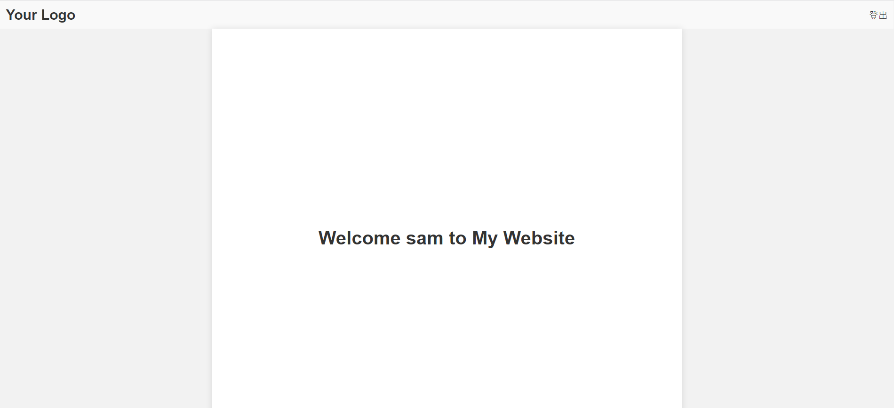
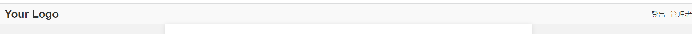
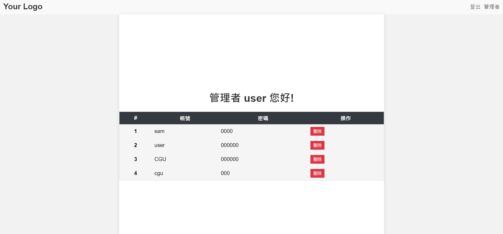
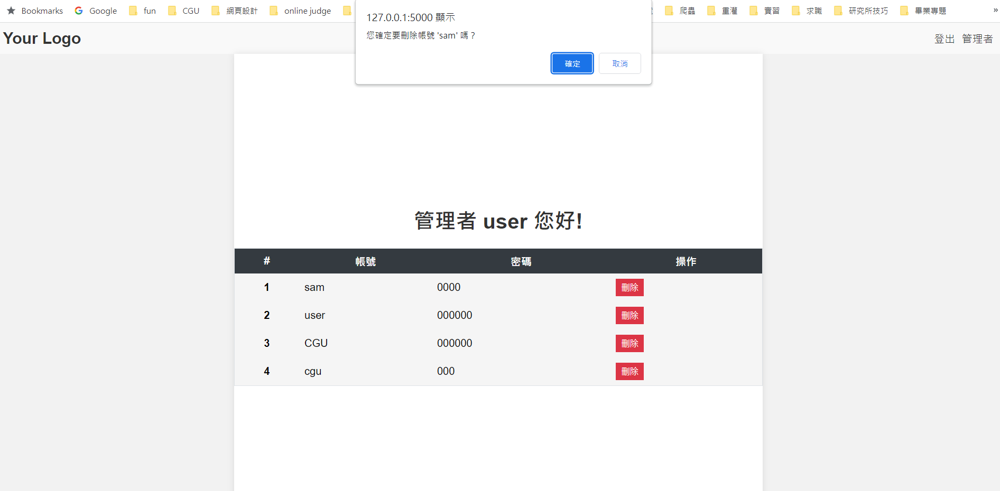
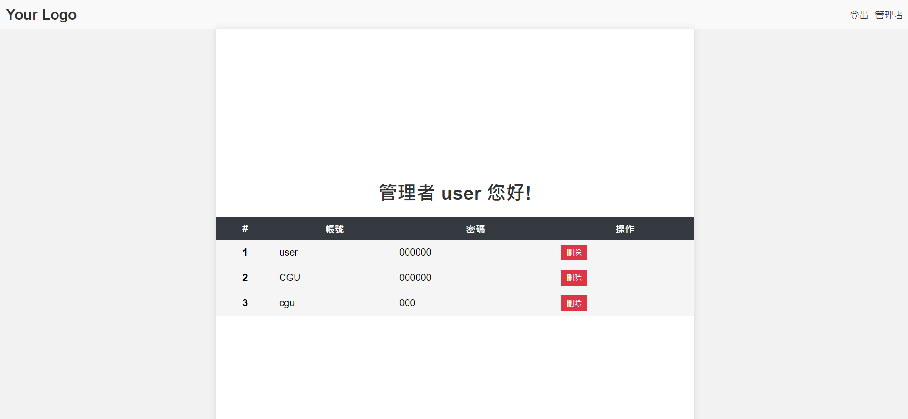

# 登入功能(6)-管理者界面
## 前言
前幾天我們已經完成登入、註冊等功能，然而一般系統都會有管理者，今天就讓我們實現如何簡易的創建管理者，此管理者可以查看目前已註冊的user，並選擇要不要刪除他們。
[完整程式]()
## 範例
1. manger function
    ```python
    @app.route('/manager', methods=['GET', 'POST'])  # 登入
    def manager():
        user = current_user.get_id()
        if user != 'user':
            return redirect(url_for('index'))

        db = get_db()
        result = db.execute('SELECT account, password FROM members').fetchall()
        size = len(result)

        return render_template('manager.html', user=user, data=result, size=size)
    ```
    首先使用了@app.route()裝飾器，將/manager路徑與manager()函式關聯起來。當收到GET或POST請求時，會執行manager()函式。這段程式碼檢查當前使用者是否為"user"，如果不是，則將重定向到index頁面。

    接著我們執行一個SQL查詢來獲取`account`和`password`的結果，並將結果存儲在`result`變數中。

    在`render_template()`函式中，我們將`data=result`傳遞給模板。這樣，在HTML模板中可以使用`data`變數來訪問`account`和`password`的結果。

    然後，在HTML模板中，您可以對`data`變數進行迴圈遍歷，並分別顯示每個帳號和密碼。

2. 新增manger.html
    ```html
    <div class="container">
        <h1>管理者 {{user}} 您好!</h1>
    
        <table class="table table-striped table-bordered">
            <thead class="thead-dark">
                <tr>
                    <th scope="col">#</th>
                    <th scope="col">帳號</th>
                    <th scope="col">密碼</th>
                    <th scope="col">操作</th>
                </tr>
            </thead>
        
            
            <form action="{{ url_for('delete_user') }}" method="POST">
                <tbody>
                    <tr>
                        <th scope="row">{{i+1}}</th>
                        <td>{{data[i][0]}}</td>
                        <td>{{data[i][1]}}</td>
                        <td>
                            <input type="hidden" name="username" value="{{data[i][0]}}"  >
                            <button class="btn btn-danger btn-delete" type="submit" onclick="return confirmDelete('{{data[i][0]}}')">刪除</button>
                        </td>
                    </tr>
                </tbody>
            </form>
            
        </table>
        <script>
            function confirmDelete(account) {
                return confirm("您確定要刪除帳號 '" + account + "' 嗎？");
            }
        </script>
    </div>
    ```

    這樣，您可以在HTML模板中直接使用`data[i][0]`來顯示第`i`個帳號，`data[i][1]`來顯示第`i`個密碼，此外我們給予一個`form`包住此`tbody`以及給於一個隱藏的input用來存uerid，這樣就可以透過post的方式刪除user了。
3. delete usr function
    ```python
    @app.route('/delete_user', methods=['post'])
    def delete_user():
        user=current_user.get_id()
        user_id =  request.form['username']
        db = get_db()
        try:
            with db:
                db.execute(
                    'DELETE FROM members WHERE account = ?',
                    (user_id,)
                )
        except sqlite3.Error as e:
        # 處理刪除資料時的錯誤
            print(f"刪除資料時發生錯誤：{str(e)}")
        db = get_db()
        result = db.execute('SELECT account, password FROM members').fetchall()
        size = len(result)

        return render_template('manager.html', user=user, data=result, size=size)
    ```
    首先，當使用者提交刪除操作時，將會觸發 `/delete_user` 的路由。

    在 `delete_user()` 函式中，使用 `current_user.get_id()` 獲取當前使用者的帳號，並使用 `request.form['username']` 獲取要刪除的使用者帳號。

    接著，透過 `get_db()` 連接到資料庫，並在 with db 的上下文中執行 `db.execute()` 來刪除符合帳號條件的資料。

    如果在刪除資料時發生錯誤，使用 except sqlite3.Error as e 來捕獲錯誤並進行相應的處理。

    刪除使用者後，重新從資料庫中擷取剩餘的使用者資料，並計算 `result` 的長度以獲取更新後的資料筆數。

    最後，將更新後的使用者資料和相關變數傳遞到 `manager.html` 模板中，並呈現在前端頁面中。
4. css
    ```css
    /* 基本表格樣式 */
    .table {
    width: 100%;
    border-collapse: collapse;
    }

    /* 奇數行的背景色 */
    .table-striped tbody tr:nth-of-type(odd) {
    background-color: #f5f5f5;
    }

    /* 表格頭部的背景色 */
    .thead-dark {
    background-color: #343a40;
    color: #fff;
    }

    /* 表格邊框 */
    .table-bordered {
    border: 1px solid #dee2e6;
    }

    /* 表格單元格的內邊距 */
    .table th,
    .table td {
    padding: 8px;
    }

    /* 刪除按鈕 */
    .btn-danger {
    background-color: #dc3545;
    color: #fff;
    border: none;
    padding: 4px 8px;
    cursor: pointer;
    }
    ```
    讓顯示稍微好看一點
        
4. 修改`base.html`的判斷
    ```html
    <div class="nav">
         
        
        <a class="nav-link" href="/logout">登出</a></li>
        <a class="nav-link" href="/manager">管理者</a></li>
        
        <a class="nav-link" href="/logout">登出</a></li>
        
        <a class="nav-link" href="/login">登入</a></li>
        <a class="nav-link" href="/signup">註冊</a></li>
        
         
    </div>
    ```
    在此範例中我們綁定`user`為管理者，只有當登入人為`user`時才會顯示管理者的頁面，反之只會顯示登出，用這樣方法達成簡易的管理者實作。

## 結果
### 非管理者

### 管理者

### 管理者介面

### 刪除確認

### 刪除後

## 總結
這樣我們就達成簡易的管理者介面了，但要注意真正的管理者介面不可能那麼陽春，此範例主要是希望讀者可以快速學會database與flask和post的操作而已。

登入功能也終於告一段落明天將會是全新的單元!