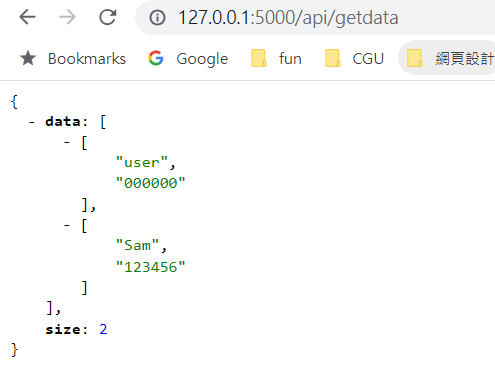
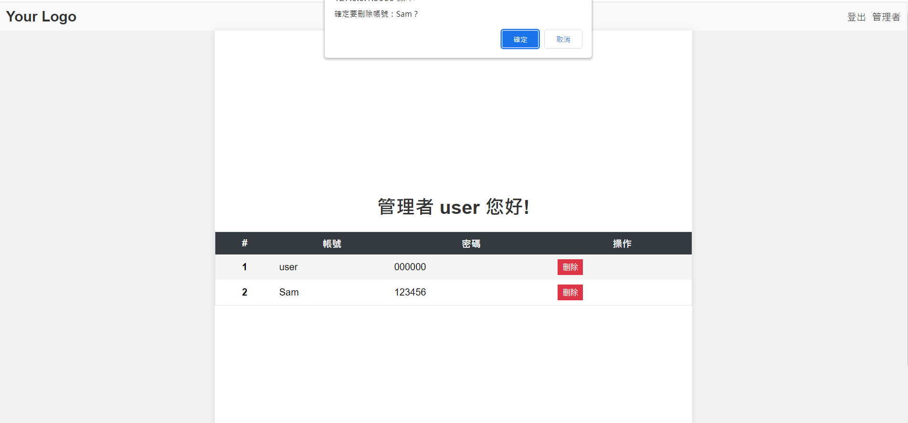
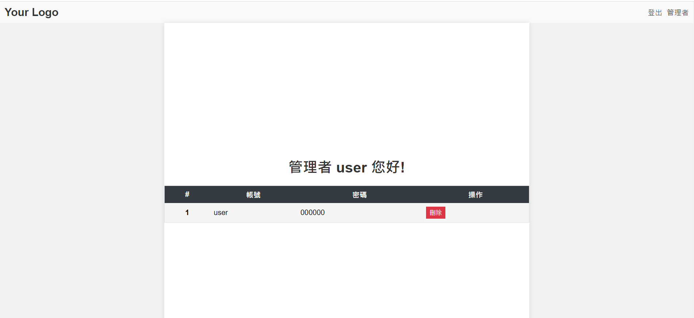
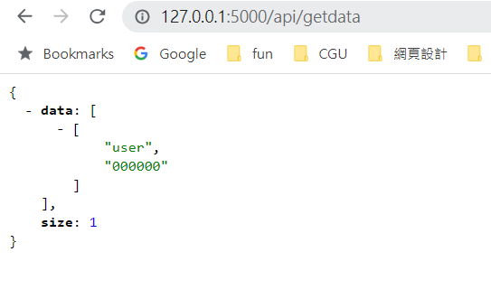

# API創建
## 前言
前幾天我們已經完成整個簡易的登入功能，但實際上現代的網頁開發趨向使用 API（Application Programming Interface）作為資料的傳輸和交互方式，而不僅僅是依賴 HTML 表單（HTML Form）
[完整程式]()
## 介紹
API（應用程式介面）是允許不同軟體應用程式之間進行通訊和互動的一組定義和協議。它定義了軟體元件之間如何相互溝通、交換資訊和進行操作。

API 可以視為一個橋梁，使不同的軟體系統能夠彼此溝通並共享資料和功能。透過 API，開發人員可以輕鬆地使用其他軟體應用程式提供的功能，而無需深入了解其內部實作細節。API 定義了一組可用的指令集或端點（endpoints），開發人員可以使用這些指令集來發送請求並接收回應。

API 可以是不同形式的，包括網路 API、網頁 API、服務 API、庫 API 等。其中，網路 API 是最常見的形式，它基於網際網路協議（如 HTTP）來實現資料的傳輸和通訊。開發人員可以通過 HTTP 請求（例如 GET、POST、PUT、DELETE）來使用 API 提供的服務或資源。

API 可以用於各種用途，例如：

- 整合第三方服務：開發人員可以使用其他公司或平台提供的 API，以整合其服務或資源到自己的應用程式中，例如整合地圖服務、支付服務或社交媒體平台。
- 建立軟體開發工具：開發人員可以創建庫、框架或工具的 API，使其他開發人員可以使用它們來開發軟體應用程式。
- 開放數據：政府、組織或公司可以提供公開的 API，使開發人員能夠存取和使用他們的資料，例如氣象數據、交通資訊或金融資訊。

使用 API 的主要優點是促進了系統之間的整合和協作，提高了開發效率和彈性。開發人員可以重複使用現有的 API，而不需要重新實作相同的功能，同時可以專注於自己的核心業務邏輯。
API 提供了一種標準的接口和協議，使不同的軟體系統能夠互相溝通、共享資訊和功能，促進了軟體開發的互聯互通。

## 範例
1. 環境
    如果您想將之前DATABASE包裝成 API，以便其他應用程序可以使用它，可以使用 Flask 的 `jsonify` 函式將資料轉換為 JSON 格式。

    首先，請確保在您的程式中導入 `jsonify` 函式：

    ```python
    from flask import jsonify
    ```
    請注意，使用 `jsonify` 函式需要確保您的應用程式中已安裝相關的套件（例如，`Flask-JSON`）。如果您尚未安裝，可以使用以下命令進行安裝：

    ```shell
    pip install flask-json
    ```
    如果有
    ```shell
    error ImportError: cannot import name 'safe_str_cmp' from 'werkzeug.security'
    ```
    請再加上兩行
    ```shell
    pip install flask_wtf --upgrade
    pip install flask_login --upgrade
    ```
2. get api 
    接著，在 `get_data_api()` 函式中，將 `result` 資料轉換為 JSON 格式，並使用 `jsonify()` 函式傳送回應。

    ```python
    @app.route('/api/getdata', methods=['GET'])
    def get_data_api():
        db = get_db()
        result = db.execute('SELECT account, password FROM members').fetchall()
        size = len(result)
        return jsonify(data=result, size=size)
    ```

    這樣，當您訪問 `/api/getdata` 路由時，將以 JSON 格式返回 `result` 和 `size` 資料。

3. delete api
    跟之前的delete_user很像，只是也是改成jsonify回傳
    ```python
    @app.route('/api/delete_user', methods=['DELETE'])
    def delete_user_api():
        # 在這裡從 DELETE 請求中取得要刪除的帳號資訊
        account = request.json.get('account')

        # 在這裡執行刪除操作，刪除資料庫中的資料
        db = get_db()
        try:
            with db:
                db.execute('DELETE FROM members WHERE account = ?', (account,))
        except sqlite3.Error as e:
            # 處理刪除資料時的錯誤
            print(f"刪除資料時發生錯誤：{str(e)}")
            return jsonify(success=False)  # 回傳刪除失敗的回應

        # 取得刪除後的資料
        result = db.execute('SELECT account, password FROM members').fetchall()
        size = len(result)

        # 回傳 JSON 格式的回應，表示刪除成功，並附帶資料和大小
        return jsonify(success=True, data=result, size=size)
    ```
4. 修改html
    ```html
    <body>
        

        <div class="container">
            <h1>管理者 {{user}} 您好!</h1>
        
            <table class="table table-striped table-bordered">
                <thead class="thead-dark">
                    <tr>
                        <th scope="col">#</th>
                        <th scope="col">帳號</th>
                        <th scope="col">密碼</th>
                        <th scope="col">操作</th>
                    </tr>
                </thead>
        
                <tbody id="table-body">
                    <!-- 表格內容將會動態填充 -->
                </tbody>
            </table>
        </div>
    ```
5. 新增js來向後端發送delete跟get請求
    ```js
    function confirmDelete(account) {
            if (confirm("確定要刪除帳號：" + account + "？")) {
                deleteUser(account);
            }
        }
    
    function deleteUser(account) {
        fetch('/api/delete_user', {
            method: 'DELETE',
            headers: {
                'Content-Type': 'application/json'
            },
            body: JSON.stringify({ account: account })
        })
        .then(response => response.json())
        .then(data => {
            // 刪除成功後重新載入資料
            if (data.success) {
                loadData();
            }
        })
        .catch(error => {
            console.error("刪除資料時發生錯誤：", error);
        });
    }

    function loadData() {
        fetch('/api/getdata')
        .then(response => response.json())
        .then(data => {
            const size = data.size;
            const tableBody = document.getElementById('table-body');
            tableBody.innerHTML = ''; // 清空表格內容

            for (let i = 0; i < size; i++) {
                const account = data.data[i][0];
                const password = data.data[i][1];

                const row = document.createElement('tr');
                row.innerHTML = `
                    <th scope="row">${i+1}</th>
                    <td>${account}</td>
                    <td>${password}</td>
                    <td>
                        <input type="hidden" name="username" value="${account}">
                        <button class="btn btn-danger btn-delete" type="button" onclick="return confirmDelete('${account}')">刪除</button>
                    </td>
                `;

                tableBody.appendChild(row);
            }
        })
        .catch(error => {
            console.error("載入資料時發生錯誤：", error);
        });
    }

    // 載入初始資料
    loadData();
    ```
    我們新增了 `deleteUser` 函式和 `loadData` 函式。`deleteUser` 函式用於發送 DELETE 請求並處理刪除後的回應，而 `loadData` 函式則用於載入初始資料和重新載入資料。

    此外，我們將按鈕的 type 改為 "button"，以避免表單提交。

    在上面的程式碼中，我們假設你的刪除 API 端點為 `/api/delete_user`，並且它會返回 JSON 物件，其中包含 success 屬性，用於指示刪除是否成功。

    請確保你的後端程式碼中有正確處理 DELETE 請求，並在成功刪除後返回適當的回應。

    這樣修改後，當你按下刪除按鈕時，它應該會發送 DELETE 請求到 API 端點並處理刪除資料的邏輯。接著，它會重新載入資料並更新表格的內容。

    
## 結果
### API格式

### 刪除確認

### 刪除後


## 總結
包裝成API後，寫法也會大不相同，需要透過js來發送request，但是這麼做可以使前後端更加分離，在分工上好很多。