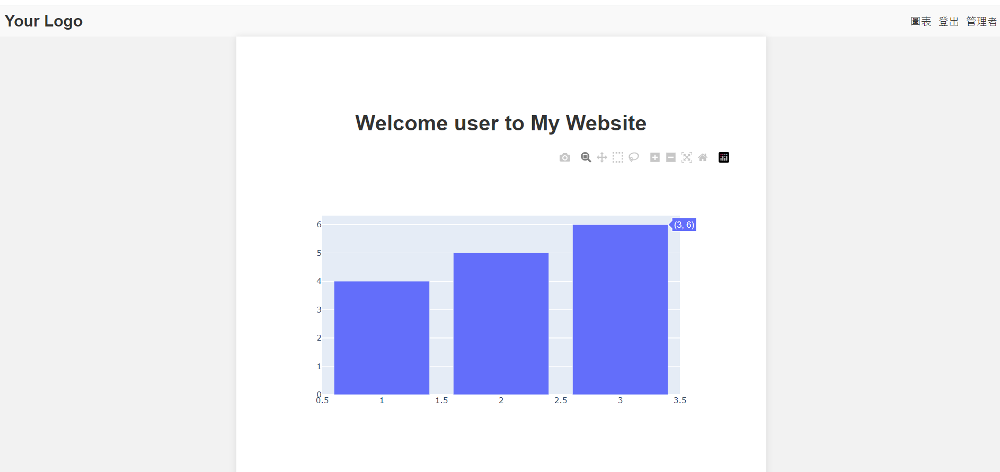

# plotly與flask(1) 畫出簡易的資料視覺圖吧
## 前言
前幾天我們將之前的範例模組化了，接下來讓我們來新增一個可以畫圖表的page吧! 最終目標會以台股k線圖為主軸，至於工具則選用了plotly。
## 介紹
Plotly 是一個功能強大的資料可視化工具，它提供了各種視覺化類型，包括折線圖、柱狀圖、散點圖、熱圖等。它能夠以互動方式呈現資料，並支援許多自定義選項，使得資料分析和呈現更加靈活和豐富。

Plotly 和 Flask 的結合能夠實現在 Web 應用程式中展示 Plotly 圖表的功能。你可以使用 Plotly 在 Flask 應用程式中生成圖表，然後將這些圖表嵌入到網頁中，使用戶可以通過網頁與圖表進行互動。

在 Flask 中使用 Plotly，你需要將 Plotly 圖表的 HTML 代碼插入到 Flask 模板中，這樣瀏覽器就能夠正確顯示該圖表。你可以使用 Plotly 提供的 `to_html()` 函式將圖表轉換為 HTML 字串，然後在 Flask 的模板中使用該字串。

## 範例
1. 新增plotbar函式到`views.py`
    ```python
    import plotly.graph_objects as go
    @views_bp.route('/plot')
    @login_required
    def plotbar():
        # 建立 Plotly 圖表
        user_id = current_user.get_id()
        fig = go.Figure(data=go.Bar(x=[1, 2, 3], y=[4, 5, 6]))

        # 將圖表轉換為 HTML 字串
        plot_html = fig.to_html()

        # 傳遞圖表 HTML 到模板中
        return render_template('plot.html', plot_html=plot_html,user_id=user_id)
    ```

    在上述示例中，我們建立了一個簡單的 Flask 應用程式，並在根路由處定義了一個視圖函式 `plotbar()`。在該函式中，我們建立了一個 Plotly 圖表，將其轉換為 HTML 字串，並將該字串傳遞到名為 `plot.html` 的模板中。在模板中，我們使用 `plot_html` 變數顯示該圖表的 HTML。

    這樣，當用戶訪問根路由時，Flask 將呈現 `plot.html` 模板並將 Plotly 圖表嵌入到網頁中，用戶可以在瀏覽器中看到並與該圖表互動，此外也與之前的登入結合，要使用者登入後才能體驗此頁面。
2. 新增`plot.html`到templates資料夾
    ```html
    <!DOCTYPE html>
    <html>
    <head>
        <title>Plotly with Flask</title>
        <script src="https://cdn.plot.ly/plotly-latest.min.js"></script>
        <link type="text/css" rel="stylesheet" href="{{ url_for('static', filename='css/style.css') }}" />

    </head>
    <body>
        
        

        <div class="container">
            <h1>Welcome {{user_id}} to My Website</h1>
            <div id="plot">{{ plot_html|safe }}</div>
            </div>        

        <footer>
            &copy; 2023 Your Company. All rights reserved.
        </footer>
        <!-- 在此處插入 Plotly 圖表的容器 -->        
    </body>
    </html>
    ```
    沒啥特別的但要記得要把`<script src="https://cdn.plot.ly/plotly-latest.min.js"></script>`引入。
3. 修改`base.html`
    ```html
    <header>
        <div class="logo">
            Your Logo
        </div>
        <div class="nav">
            
            <a class="nav-link" href="/plot">圖表</a></li>
            <a class="nav-link" href="/logout">登出</a></li>
            <a class="nav-link" href="/manager">管理者</a></li>
            
            <a class="nav-link" href="/plot">圖表</a></li>
            <a class="nav-link" href="/logout">登出</a></li>
            
            <a class="nav-link" href="/login">登入</a></li>
            <a class="nav-link" href="/signup">註冊</a></li>
            
            
        </div>
    </header>
    ```
    使得登入後才會看到進入圖表的button
## 結果


## 總結
Plotly 與 Flask 的結合使你能夠在 Web 應用程式中展示動態和互動的資料可視化圖表，為用戶提供更豐富的數據呈現體驗，明天就讓我們來畫k線吧。