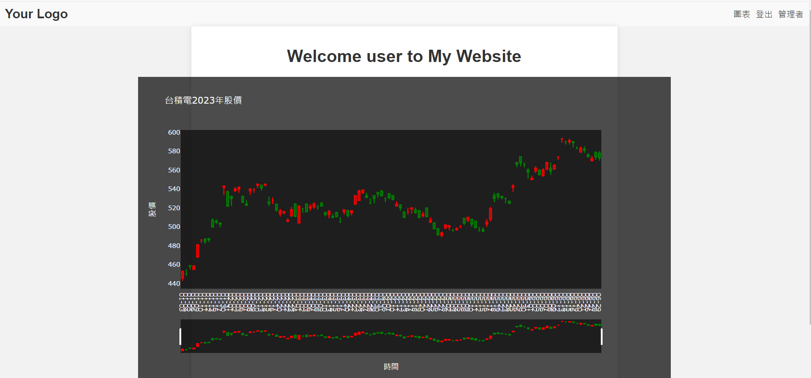
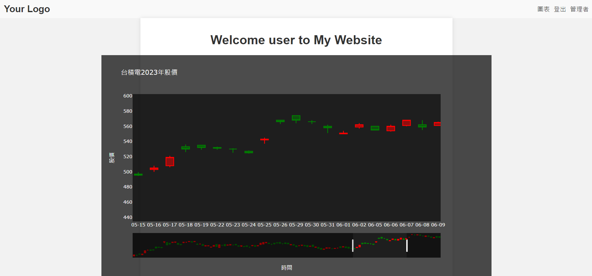

# plotly與flask(2) 畫出台積電日K
## 前言
在昨天我們已經了解如何使用plotly畫圖，而今天的範例會搭配yfinance畫出台積電上半年的股價做一個範例。

[完整code]()
## 介紹
yfinance是一個可以快速從yahoo股市爬取股價的一個套件，方法如下:
```python
df = yf.download("2330.TW", start="2023-1-1",end="2023-6-30")
```
`yf.download()` 是 `yfinance` 套件中用於下載金融資料的函式之一。透過此函式，你可以從 Yahoo Finance 下載指定股票的歷史股價資料，並將其存到df中。

以下是 `df` 的資料格式：

`df` 是一個 Pandas DataFrame 物件，其中包含了下載的股價資料。DataFrame 是一種表格型資料結構，它以行和列的形式組織資料。在這個特定的情境中，`df` 包含了以下欄位：

- **Date**: 日期，表示每個交易日的日期。
- **Open**: 開盤價，表示每個交易日的開盤價格。
- **High**: 最高價，表示每個交易日的最高價格。
- **Low**: 最低價，表示每個交易日的最低價格。
- **Close**: 收盤價，表示每個交易日的收盤價格。
- **Adj Close**: 調整後的收盤價，表示考慮了股票分割和派息的調整後價格。
- **Volume**: 交易量，表示每個交易日的成交量。

這些欄位以列的形式組織在 DataFrame 中，每一列對應於一個特定的日期。你可以使用 DataFrame 的各種方法和屬性來操作和分析資料，例如選取特定日期範圍的資料、計算統計指標、繪製圖表等。

藉由 `yf.download()` 函式取得的 DataFrame 可以讓你方便地進行後續的資料分析和視覺化工作，以瞭解該股票在指定日期範圍內的價格變化和交易量情況。
## 範例
1. 新增plot_k_diagram函式到`views.py`
    ```python
    def plot_k_diagram(grouped_data):
    '''
    繪製大盤指數與情緒的疊圖
    grouped_data: 分組後的資料，包含 Open、High、Low、Close 等欄位
    '''
    x_labels = [date.strftime('%m-%d') for date in grouped_data.index]
    increasing_color = 'red'
    decreasing_color = 'green'
    start_date = grouped_data.index.min()
    end_date = grouped_data.index.max()

    # 移除沒有資料的日期
    grouped_data = grouped_data.dropna()

    # 建立子圖表，包含兩個軸
    fig = make_subplots(specs=[[{"secondary_y": True}]])

    fig.add_trace(
        go.Candlestick(
            x=grouped_data.index,
            open=grouped_data['Open'],
            high=grouped_data['High'],
            low=grouped_data['Low'],
            close=grouped_data['Close'],
            increasing_line_color=increasing_color,
            decreasing_line_color=decreasing_color,
            name='Stock'
        )
    )

    # 設置圖表的標題和軸標籤
    fig.update_layout(
        width=1000,
        height=600,
        title=dict(
            text='台積電2023年股價',
            font=dict(color='white')
        ),
        xaxis=dict(
            title='時間',
            title_font=dict(color='white'),
            range=[start_date, end_date],  # 設置 x 軸範圍
            type='category',  # 設定 x 軸類型為 category
            tickfont=dict(color='white'),
            ticktext=x_labels,  # 設定刻度標籤文字
            tickvals=list(range(len(x_labels))),  # 設定刻度標籤的索引位置
            showgrid=False,
        ),
        yaxis=dict(
            title='股價',
            title_font=dict(color='white'),
            showgrid=False,
            tickfont=dict(color='white')
        ),
        plot_bgcolor='rgba(0, 0, 0, 0.6)',  # 背景設為透明黑
        paper_bgcolor='rgba(0, 0, 0, 0.7)'  # 背景設為透明
    )

    return fig
    ```
    1. `x_labels = [date.strftime('%m-%d') for date in grouped_data.index]`：建立 x 軸的刻度標籤文字，將分組後的資料索引中的日期格式化為 '%m-%d' 形式。

    2. `increasing_color = 'red'` 和 `decreasing_color = 'green'`：設定增長和下降的股價的顏色，因為plotly預設是美股的方式與台股不同。

    3. `start_date = grouped_data.index.min()` 和 `end_date = grouped_data.index.max()`：找到分組後資料索引的最小日期和最大日期。

    4. `grouped_data = grouped_data.dropna()`：移除沒有資料的日期。

    5. `fig = make_subplots(specs=[[{"secondary_y": True}]])`：建立一個子圖表，其中包含兩個 y 軸，之所以這樣做是方便讀者在後續可以將均線或成交量作疊圖，但這次的鐵人賽我不會教大家怎麼做。

    6. `fig.add_trace(go.Candlestick(...))`：新增燭台圖藍圖到子圖表中，使用分組後資料的日期、開盤價、最高價、最低價和收盤價等欄位。

    7. `fig.update_layout(...)`：設置圖表的佈局，包括圖表的寬度、高度、標題、軸標籤、背景色等，這裡我設定了透明黑的背景以及白色的標題和刻度。

    8. `return fig`：返回建立的圖表物件。

    總結來說，這個函數使用分組後的資料繪製燭台圖，並將圖表的標題、軸標籤、背景色等進行設定。該圖表顯示了台積電股價在不同日期的開盤價、最高價、最低價和收盤價，並根據股價的漲跌顏色進行區分。
2. 將`plotkdiagram()`新增至`views.py`
    ```python
    @views_bp.route('/plot')
    @login_required
    def plotkdiagram():
        # 建立 Plotly 圖表
        
        df = yf.download("2330.TW", start="2023-1-1",end="2023-6-30")
        user_id = current_user.get_id()
        
        fig=plot_k_diagram(df)
        # 將圖表轉換為 HTML 字串
        plot_html = fig.to_html()

        # 傳遞圖表 HTML 到模板中
        return render_template('plot.html', plot_html=plot_html,user_id=user_id)
    ```
    就是透過yf.download()將台積電的股價存到df中，在將其丟到上面的畫圖函式並宣染到`plot.html`中。
## 結果
### 上半年股價

### 可自己調整範圍

## 總結
今天教導大家如何畫製日K當然目前皆是寫死的，如果讀者想要將日期、股票代碼都可以自己選擇，只要透過html form並將input傳遞給flask即可，如果有從頭到尾看完我相信對大家來說絕非難事，歡迎大家先試試看有問題在詢問。

plotly的教學就先告一段落啦，接下來剩餘的天數皆是linebot串接的篇幅了。