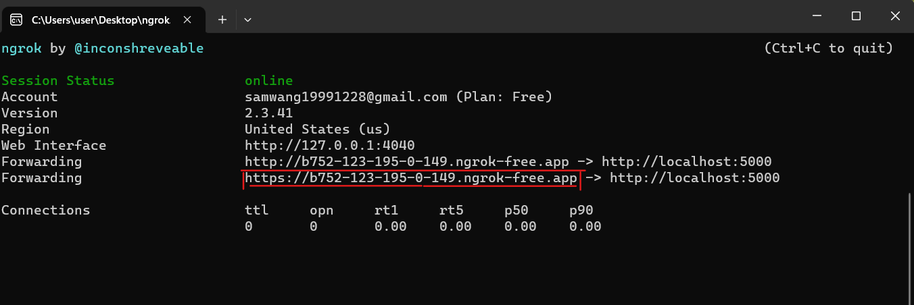

# flask與line bot
## 前言
剩餘的十天我將帶大家使用flask建立自己的line bot，至於今天則是教大家基本的環境設置。

[完整code]()
## 介紹
Line Message API 是由 Line 提供的一組 API，用於開發 Line Bot，讓開發者能夠在 Line 平台上建立自動回覆的聊天機器人。Line Bot 可以透過 Message API 接收用戶傳送的訊息，並回覆文字、圖片、影片、音訊等訊息給用戶。

以下是 Line Message API 的主要特點：

1. 訊息類型：Line Message API 支援多種訊息類型，包括文字訊息、圖片訊息、影片訊息、音訊訊息、位置訊息、貼圖訊息等，開發者可以根據需求選擇適合的訊息類型。

2. 快速回覆：開發者可以使用 Line Message API 快速回覆用戶的訊息，讓用戶感受到即時的互動體驗。

3. 多語言支援：Line Message API 支援多種語言，讓開發者能夠開發全球範圍的 Line Bot。

4. 圖片、影片、音訊媒體檔：開發者可以透過 API 上傳媒體檔案至 Line 平台，並將媒體檔案連結在訊息中，提供更豐富的訊息內容。

5. Flex Message：Flex Message 是 Line Message API 中的一項特殊功能，可以讓開發者使用豐富的佈局和元件來設計更具彈性的訊息，讓用戶有更好的視覺體驗。

6. 訊息推送：除了回覆用戶訊息外，開發者還可以使用 Line Message API 來推送訊息給用戶，例如廣告、推廣活動等。

開發者可以使用 Line Message API 配合 Line Bot SDK 或其他程式語言的 HTTP 請求來實作 Line Bot。在建立 Line Bot 之前，需要先在 Line Developer Console 中建立一個 Channel，獲取 Channel Access Token 和 Channel Secret，用來驗證 Line Bot 的身份和授權權限。

總結來說，Line Message API 提供了一個便利的方式讓開發者在 Line 平台上建立自動回覆的聊天機器人，並提供多樣化的訊息類型和彈性的設計選項，讓開發者能夠打造更具吸引力和互動性的 Line Bot。
## 流程
### 創建line開發者帳號
[開發者網站](https://account.line.biz/login?redirectUri=https%3A%2F%2Fdevelopers.line.biz%2Fconsole%2Fprovider%2F1656368068)點進去可以透過已有的line帳號登入接著點擊messaging api
接著隨你開心填寫機器人的資訊

勾勾打勾後就可以創建了
### 取得line api key
* Channel secret(頻道密碼)：位於Basic settings頁籤

* Channel access token(頻道憑證)：位於Messaging API頁籤中，要按下右方的「Issue」按鈕才會出現

### pyton code

```
pip install line-bot-sdk
```

```python
from flask import Flask, request, abort

from linebot import (
    LineBotApi, WebhookHandler
)
from linebot.exceptions import (
    InvalidSignatureError
)
from linebot.models import *
 
 
#======python的函數庫==========

app = Flask(__name__)
 
 
 
LINE_CHANNEL_ACCESS_TOKEN = '你的Channel access token'
 
LINE_CHANNEL_SECRET = '你的Channel secret'
line_bot_api = LineBotApi(LINE_CHANNEL_ACCESS_TOKEN)
handler = WebhookHandler(LINE_CHANNEL_SECRET)
# 監聽所有來自 /callback 的 Post Request
@app.route("/callback", methods=['POST'])
def callback():
    # get X-Line-Signature header value
    signature = request.headers['X-Line-Signature']
    # get request body as text
    body = request.get_data(as_text=True)
    app.logger.info("Request body: " + body)
    # handle webhook body
    try:
        handler.handle(body, signature)
    except InvalidSignatureError:
        abort(400)
    return 'OK'


# 處理訊息
@handler.add(MessageEvent, message=TextMessage)
def handle_message(event):
    msg=str(event.message.text)
    
    line_bot_api.reply_message(event.reply_token, TextSendMessage(msg))

@handler.add(PostbackEvent)
def handle_message(event):
    print(event.postback.data)


@handler.add(MemberJoinedEvent)
def welcome(event):
    uid = event.joined.members[0].user_id
    gid = event.source.group_id
    profile = line_bot_api.get_group_member_profile(gid, uid)
    name = profile.display_name
    message = TextSendMessage(text=f'{name}歡迎加入')
    line_bot_api.reply_message(event.reply_token, message)
        
        
import os
if __name__ == "__main__":
    port = int(os.environ.get('PORT', 5000))
    app.run(host='0.0.0.0', port=port,debug=True)
```
 
1. 引入函式庫：
   - `Flask`：這是 Python 的 Web 框架，用於處理 Web 請求和回應。
   - `LineBotApi` 和 `WebhookHandler`：這兩個類別是 Line Bot SDK 提供的，用於處理 Line Bot 相關的操作和事件。
   - `InvalidSignatureError`：這是一個異常類別，用於處理簽名驗證失敗的情況。
   - `TextMessage` 和其他相關的訊息類別：這些是用於處理 Line Bot 收到的不同類型的訊息。

2. 設定 Line Bot 相關的變數：
   - `LINE_CHANNEL_ACCESS_TOKEN`：這是你在 Line Developer Console 中獲取的 Channel Access Token。
   - `LINE_CHANNEL_SECRET`：這是你的 Channel Secret。

3. 建立 Flask App 物件：
   - `app = Flask(__name__)`：建立一個 Flask App 物件。

4. 定義 Callback 路由：
   - `@app.route("/callback", methods=['POST'])`：這是用於處理 Line Bot 的 Webhook，接收來自 Line 平台的 POST 請求。

5. 定義 Callback 函數：
   - `callback()`：這個函數處理收到的 Webhook 資料，包括驗證簽名和處理事件。

6. 處理訊息事件：
   - `@handler.add(MessageEvent, message=TextMessage)`：這個裝飾器用於處理收到的文字訊息事件，當使用者傳送文字訊息時，會執行 `handle_message(event)` 函數。在這個範例中，收到的文字訊息會被回覆相同的訊息。

7. 處理 Postback 事件：
   - `@handler.add(PostbackEvent)`：這個裝飾器用於處理收到的 Postback 事件，當使用者點擊卡片按鈕時，會執行 `handle_message(event)` 函數。

8. 處理成員加入事件：
   - `@handler.add(MemberJoinedEvent)`：這個裝飾器用於處理新成員加入群組的事件，會執行 `welcome(event)` 函數來回覆歡迎訊息。

9. 啟動 Flask App：
   - `if __name__ == "__main__":`：這個條件判斷確保只有在直接運行腳本時才啟動 Flask App。
   - `app.run(host='0.0.0.0', port=port, debug=True)`：這個語句啟動 Flask App，並設定主機和埠號。`debug=True` 表示啟用除錯模式。

最後記得要啟動flask
### ngrok serve
Ngrok簡單來說，就是能夠將你本機的IP埠號(http://127.0.0.1:5000)
，對應到一個隨機產生的HTTPS網址，並且這個HTTPS網址是對外公開的(Public)的這樣才能讓line讀到我們的請求

Download下面有你的token(待會會用)

解壓縮後打開ngrok.exe接者輸入
```
ngrok authtoken <YOUR TOKEN>
ngrok http 5000
```
 
紅色框框就是你的網域

### 安裝網域至line
將剛才的紅色框框加上/callback後輸入至message API的

Webwook URL中，在按下verify若出現success變成功。

再來要把預設功能關掉後就能掃描QR code玩玩看囉～


## demo
因為我們是直接把讀到的msg回傳給使用者，所以完成品會長這樣~

## 結語
今天我們介紹了如何將flask透過ngrok跟line bot做串接，至於接下來我將會帶大家實現一個個實用功能以及完成一個小project。
