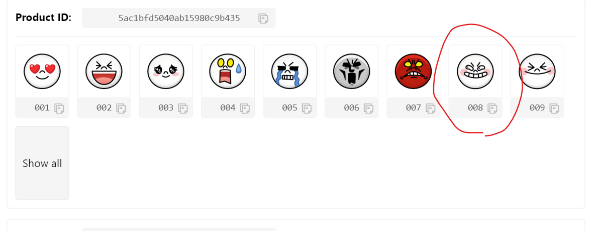
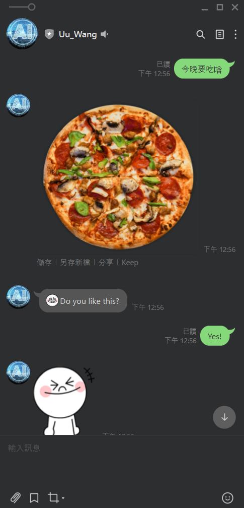

# flask與line bot
## 前言
昨天已經教導大家如何透過flask、ngrok串接line message api了，接者今天我們就可以實現一些小功能啦，會以傳送文字、圖片、貼圖等功能為主。

[完整code]()
## 介紹
Line message API 提供了許多套件可以讓我們實現上述功能像是:
* 傳送文字-`TextSendMessage(text="你要傳的文字")`
只要將你想傳入的文字放入parameter中的text就能傳送你指定的文字。
* 快速回復-`QuickReply(item='你要顯示的回覆')`
通常會搭配QuickReplyButton使用接下來會在範例提到。
* 傳送表情-`emojis='指定的id'` [表情的id list在這](https://developers.line.biz/en/docs/messaging-api/emoji-list/#line-emoji-definitions)
可以傳送line原有的表情並要創建emojis物件

```python
text_message = TextSendMessage(
    text='$Do you like this?',
    emojis=[
        {
            'index': 0, 
            'productId': '5ac1bfd5040ab15980c9b435', 
            'emojiId': '008'
        },
    ],
)
```
這裡的index為你要插入表情的字串位置，**要注意對應的位置要加上$**，productID、emojiId則是要透過查表取得。
* 傳送貼圖-`StickerSendMessage(package_id='id1',sticker_id='id2')`[貼圖id list在這](https://developers.line.biz/en/docs/messaging-api/sticker-list/)
跟表情不同的在於他是使用package_id跟sticker_id去做對應一樣可以透過查表得到。
* 傳送圖片-`ImageSendMessage(original_content_url,preview_image_url)`
original_content_url：必須是圖片的原始 URL，且必須是以 HTTPS 開頭的安全鏈接。這是您要傳送給使用者的圖片的真實 URL。
preview_image_url：預覽圖片的 URL，同樣也必須是以 HTTPS 開頭的安全鏈接。預覽圖片是當使用者在 LINE 聊天中看到圖片時顯示的縮略圖，通常較小且較輕量，以節省用戶的數據和加快圖片加載速度。
* 回覆訊息-`line_bot_api.reply_message(event.reply_token,剛剛創立的物件)`
只要把上述成功創立的物件放入就能傳送你想要的內容。
## 範例
### 傳送文字表情+快速回覆
```python
def handle_message(event):
    mtext = event.message.text
    if mtext == '@傳送文字':
        try:
            quick_reply_buttons = [
                QuickReplyButton(action=MessageAction(label='Yes', text='Yes!')),
                QuickReplyButton(action=MessageAction(label='No', text='No!')),
            ]
                    
            # 建立文字訊息，並加入快速回覆按鈕
            text_message = TextSendMessage(
                text='$Do you like this?',
                emojis=[
                {'index': 0, 
                 'productId': '5ac1bfd5040ab15980c9b435', 
                 'emojiId': '008'
                 },
                ],
                quick_reply=QuickReply(items=quick_reply_buttons)
            )
            line_bot_api.reply_message(event.reply_token,text_message)
        except:
            line_bot_api.reply_message(event.reply_token,TextSendMessage(text='發生錯誤！'))
```
* mtext = event.message.text：這行程式碼取得收到的訊息文字內容，將其存儲在變數 mtext 中，以便後續使用。

* if mtext == '@傳送文字':：這行程式碼使用條件判斷，檢查收到的訊息內容是否為 @傳送文字。如果是，則執行以下操作：

* 建立了一個快速回覆按鈕清單，其中包含兩個按鈕：Yes 和 No。這些按鈕將用於快速回覆使用者。

* TextSendMessage：建立了一個文字訊息，其中包含以下屬性：
    * text：要發送給使用者的文字內容，這裡設定為 $Do you like this?。
    * emojis：指定了一個表情符號（emoji）的設定。在這裡使用了一個 emoji，其索引為 0，產品 ID 為 5ac1bfd5040ab15980c9b435，emoji ID 為 008。
    * quick_reply：使用 QuickReply 物件設定快速回覆按鈕，將之前建立的按鈕清單加入其中。

* line_bot_api.reply_message(event.reply_token, text_message)：使用 LINE Bot 的 line_bot_api 對象，回覆一則訊息給使用者。傳入的參數 event.reply_token 是回覆的 token，而 text_message 則是要回覆的文字訊息物件。

當使用者傳送 @傳送文字 的訊息給 LINE Bot 時，Bot 會回覆一則文字訊息，其中包含一個表情符號（emoji），並且提供快速回覆按鈕供使用者選擇。這是一個互動性強的應用範例，可以引導使用者進行選擇回覆。

### 傳送圖片
```python
elif mtext == '@傳送圖片':
    try:
        message = ImageSendMessage(
            original_content_url = "https://i.imgur.com/4QfKuz1.png",
            preview_image_url = "https://i.imgur.com/4QfKuz1.png"
        )
        line_bot_api.reply_message(event.reply_token,message)
    except:
        line_bot_api.reply_message(event.reply_token,TextSendMessage(text='發生錯誤！'))
```
就是把你要的img url塞進去而已。
### 傳送貼圖
```python
elif mtext == '@傳送貼圖':
    try:
        message = StickerSendMessage(  #貼圖兩個id需查表
            package_id='1',  
            sticker_id='2'
        )
        line_bot_api.reply_message(event.reply_token, message)
    except:
        line_bot_api.reply_message(event.reply_token,TextSendMessage(text='發生錯誤！'))
```
根據查表獲得的id將其放入即可。
###　多項傳送
```python
message = [  #串列
    StickerSendMessage(  #傳送貼圖
        package_id='1',  
        sticker_id='2'
    ),
    TextSendMessage(  #傳送文字
        text = "這是 Pizza 圖片！"
    ),
    ImageSendMessage(  #傳送圖片
        original_content_url = "https://i.imgur.com/4QfKuz1.png",
        preview_image_url = "https://i.imgur.com/4QfKuz1.png"
    )
]
line_bot_api.reply_message(event.reply_token,message)

```
我們只要把要傳入的物件透過[]包成串列即可。
## Demo
集合以上功能就能變成這樣~


## 結語
今天我們介紹了許多line api所提供的功能，然而他還有許多功能我們沒介紹到，明天再繼續帶大家探討~