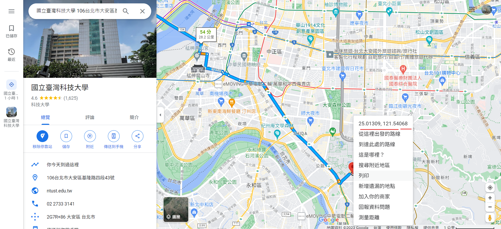
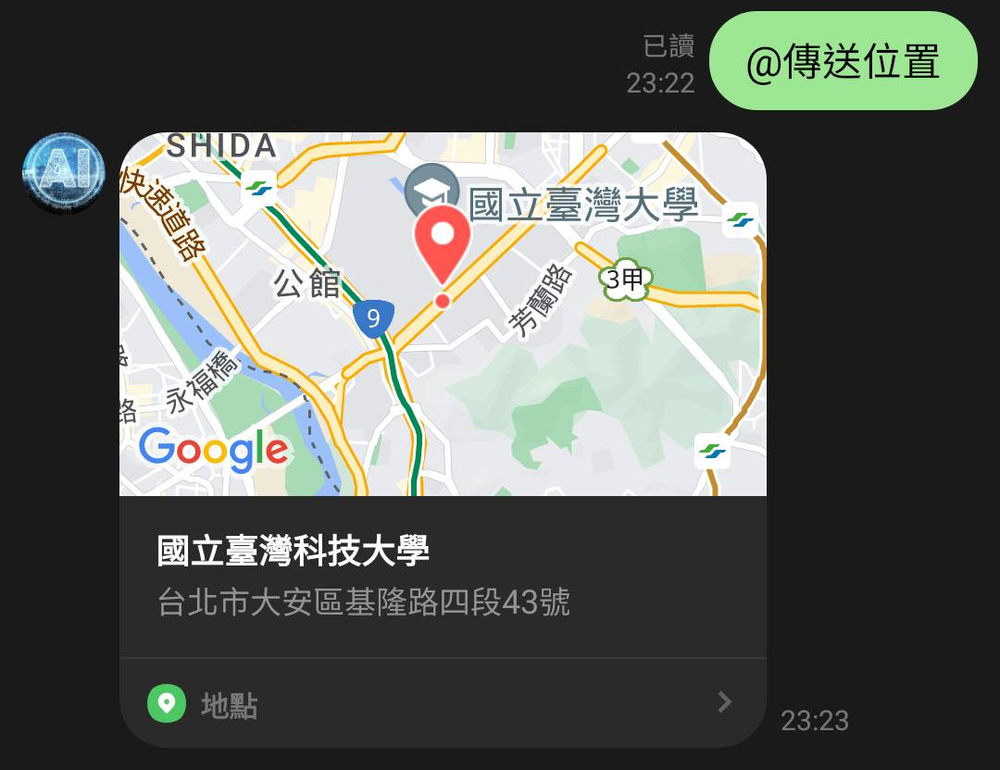
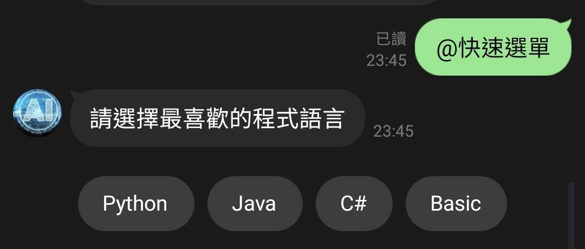
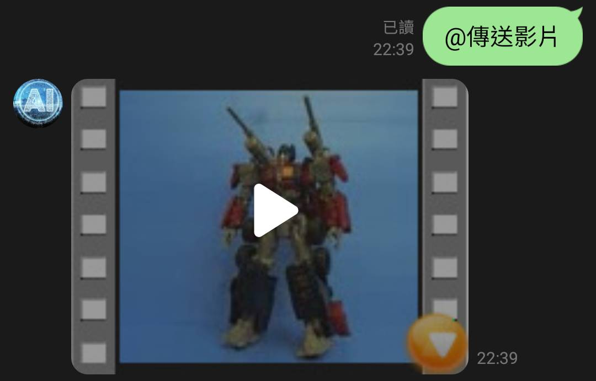

# flask與line bot
## 前言
昨天教導大家一些基本功能與API的使用，然而line提供的API還有非常多尚未介紹，今天就讓我們繼續看下去吧~會教導大家傳送影片、音檔、位置等功能。

[完整code]()
## 範例
### 傳送地址-LocationSendMessage()
```python
if mtext == '@傳送位置':
    try:
        local_message = LocationSendMessage(
            title='國立臺灣科技大學',
            address='台北市大安區基隆路四段43號',
            latitude=25.013197188546123,  #緯度, 
            longitude=121.5405027081291  #經度
        )
        line_bot_api.reply_message(event.reply_token, local_message)
    except:
        line_bot_api.reply_message(event.reply_token,TextSendMessage(text='發生錯誤！'))

```
* `Title`-為傳送地址所顯示的標題
* `Address`-為傳送位址時所顯示的內文
* `Latitude`-為你要傳送該地圖位置的緯度
* `Longitude`-為你要傳送該地圖位置的經度
至於經緯度查詢可透過gooole 地圖查詢在該位置右鍵點及即可

#### 結果


### 快速選單-QuickReply
```python
if mtext == '@快速選單':
    try:
        message = TextSendMessage(
            text='請選擇最喜歡的程式語言',
            quick_reply=QuickReply(
                items=[
                    QuickReplyButton(
                        action=MessageAction(label="Python", text="Python")
                    ),
                    QuickReplyButton(
                        action=MessageAction(label="Java", text="Java")
                    ),
                    QuickReplyButton(
                        action=MessageAction(label="C#", text="C#")
                    ),
                    QuickReplyButton(
                        action=MessageAction(label="Basic", text="Basic")
                    ),
                ]
            )
        )
        line_bot_api.reply_message(event.reply_token,message)
    except:
        line_bot_api.reply_message(event.reply_token,TextSendMessage(text='發生錯誤！'))
```
* 先透過`TextSendMessage`設定`text`來決定你要問的問題
* 再透過`QuickReply`將你要組成的button group起來
* 最後`QuickReplyButton`就是你要顯示的button，`label`為要顯示的字，`text`為按下去後要回復的文字，且要透過`MessageAction`實現
#### 範例

### 傳送音檔-AudioSendMessage
再給範例前我們必須在app.py的目錄下新增static資料夾，且要在裡面放入你想傳入的音檔，此外要加上url的位置
```python
baseurl = '你的NGROK網址/static/'  #靜態檔案網址
```
接者就能實現了
```python
 if mtext == '@傳送聲音':
    try:
        message = AudioSendMessage(
            original_content_url=baseurl+'你的音檔',  #聲音檔置於static資料夾
            duration=20000  #聲音長度20秒
        )
        line_bot_api.reply_message(event.reply_token, message)
    except:
        line_bot_api.reply_message(event.reply_token,TextSendMessage(text='發生錯誤！'))
```
* `original_content_url`為你的音檔位置也可以放置網路有公開之音檔
* `duration`為你要持續播放得秒數
#### 結果

### 傳送影片
一樣要在static資料夾裡面放入你想傳入的影片，此外要加上url的位置
```python
try:
    message = VideoSendMessage(
        original_content_url=baseurl + 'robot.mp4',  #影片檔置於static資料夾
        preview_image_url=baseurl + 'robot.jpg'
    )
    line_bot_api.reply_message(event.reply_token, message)
except:
    line_bot_api.reply_message(event.reply_token,TextSendMessage(text='發生錯誤！')) 
```
* `original_content_url`為你的影片位置也可以放置網路有公開之影片
* `preview_image_url`為影片要撥放前所要顯示的樣子
#### 範例



## 結語
今天我們介紹了更多line api所提供的功能，然而他還有許多功能我們沒介紹到，明天再繼續帶大家探討~