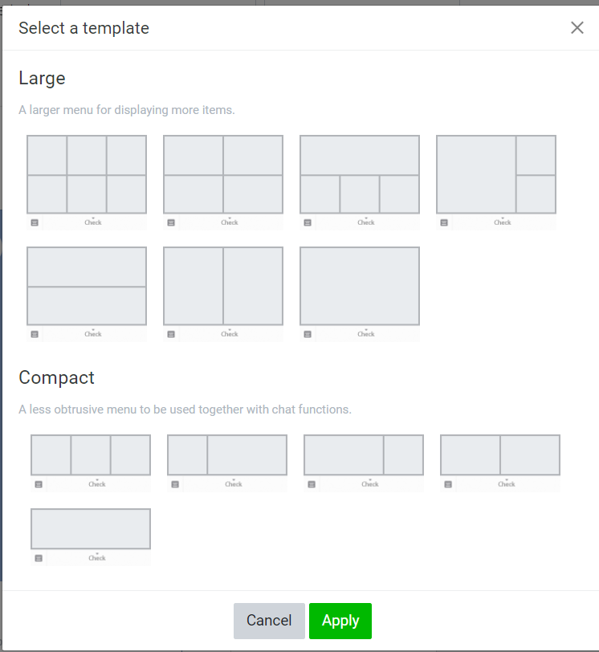

# line bot card與下方資訊欄
## 前言
官方的Line bot 很常在下方輸入欄位出現一些圖片，且按下去會有對應功能，此外也會有回覆一張卡片的功能，至於具體是怎麼實現的呢?就讓我們來向大家介紹吧。
[完整code]()
## 介紹
### 下方資訊欄
首先我們要在[line official account登入我們的line bot](https://account.line.biz/login?redirectUri=https%3A%2F%2Fmanager.line.biz%2Faccount)一樣可以用line帳號直接登入，接著等入後可以在坐上角看到你所有的line bot接者點選你要的

進到Rich menus並且點擊Create a rich menu

在這個區塊可以設定你要顯示得的下方資訊欄要多久

這個區塊則是選擇你要顯示的樣式以及插入你要顯示德圖片和功能

先點擊Template 按鈕後就可以選擇你一次要顯示幾張圖片

點擊image欄位中的select則是可以上傳你要的圖片，上傳完後可以先透過Crop按鈕去裁切圖片並把圖片移到模板位置，接著繼續點擊下方的upload image重複動作，設置完後再按下Apply

設置完後就要來賦予功能啦A、B 分別對應預覽面中的位置，左邊區塊分別可以設定兩種功能
* Link-是可以讓使用者點選後進到你指定的網址
* Text-是可以讓這個圖片點擊後傳送指定文字這樣我們在flask中就可以寫入if condition來讓他做指定的事

都設置完畢後按下最下方的apply即可
若想修改可直接點擊Title進到頁面後再按下edit就能修改了


### PostbackTemplateAction 
是 LINE Messaging API 中的一種回覆動作，通常用於處理當使用者點擊按鈕後發送回伺服器的 postback 資訊。這個動作可用於實現各種互動功能，例如確認、選擇、詢問等。

以下是 `PostbackTemplateAction` 的主要屬性和用法：

1. **`label`（必填）**：按鈕上顯示的文字，通常是一個簡短的描述或指示，例如 "確認"、"選擇" 等。

2. **`data`（必填）**：當使用者點擊按鈕時，將會發送給伺服器的資料。這通常是一個字串，你可以在伺服器端處理該資料，以便採取適當的回應動作。資料的內容可以是任何你想要的，例如一個指令、一個選項的編號等。

3. **`text`（選填）**：如果指定，則當使用者點擊按鈕時，LINE Bot 會自動將這個文字訊息送出。通常在按鈕的另一端希望提供更多資訊或說明時使用。

4. **`displayText`（選填）**：當使用者點擊按鈕時，LINE Bot 會將這個文字訊息顯示給使用者，用於確認或提示。通常用於讓使用者確認他們的操作。

5. **`datetime`（選填）**：如果指定，則 LINE Bot 會在使用者點擊按鈕時回應該按鈕所代表的日期和時間。這在需要使用日期和時間的情境中很有用，例如預約、提醒等。

簡單來說，`PostbackTemplateAction` 允許你在使用者點擊按鈕時，將一個自訂的資料傳送到伺服器，以便進行後續的處理和回應。這可以實現多種互動功能，並增加 LINE Bot 的彈性。
####　小範例
```python
from linebot.models import PostbackTemplateAction

postback_action = PostbackTemplateAction(
    label='確認',
    data='action=confirm&result=yes'  # 自訂的資料
)
```
在上面的範例中，當使用者點擊 "確認" 按鈕時，將傳送 `data` 中指定的資料給伺服器。伺服器可以根據收到的資料執行相應的處理和回應。


## 範例
### 新增PostBack事件
```python
@handler.add(PostbackEvent)  #PostbackTemplateAction觸發此事件
def handle_postback(event):
    backdata = dict(parse_qsl(event.postback.data))  #取得Postback資料
    if backdata.get('action') == 'buy':
        sendBack_buy(event, backdata)
```
這段程式碼是用於處理 LINE Bot 收到的 Postback 事件的部分。讓我們一步步解釋：

1. `@handler.add(PostbackEvent)`：這是一個裝飾器，指示 LINE Bot SDK 要處理 PostbackEvent 事件。PostbackEvent 是當使用者點擊按鈕模板中的 PostbackTemplateAction 按鈕時觸發的事件。

2. `def handle_postback(event):`：這是一個處理 Postback 事件的函式，它接收一個名為 `event` 的參數，這個參數包含了 Postback 事件的相關資訊。

3. `backdata = dict(parse_qsl(event.postback.data))`：這行程式碼用於解析 Postback 事件的資料（`event.postback.data`）。Postback 資料通常是以字串的形式傳送，使用 `parse_qsl` 函式可以將它解析為字典形式，以便更容易處理。

4. `if backdata.get('action') == 'buy':`：這個條件判斷是在檢查 Postback 資料中是否包含一個名為 `'action'` 的鍵，且其值是否等於 `'buy'`。這表示如果使用者點擊的是觸發 `'buy'` 行為的按鈕，則執行下一步的處理。

5. `sendBack_buy(event, backdata)`：如果使用者點擊的按鈕觸發了 `'buy'` 行為，則會調用 `sendBack_buy` 函式來處理相關操作。這個函式可能用於執行與 `'buy'` 有關的任何後續處理，例如回覆特定訊息或執行特定的功能。

 
### sendBack_buy
```python
def sendBack_buy(event, backdata):  #處理Postback
    try:
        text1 = '感謝您購買披薩，我們將盡快為您製作。\n
        message = TextSendMessage(  #傳送文字
            text = text1
        )
        line_bot_api.reply_message(event.reply_token, message)
    except:
        line_bot_api.reply_message(event.reply_token,TextSendMessage(text='發生錯誤！'))

```
這個大家應該很熟了就不解釋了
### 傳送卡片
```python
def sendButton(event):  #按鈕樣版
    try:
        message = TemplateSendMessage(
            alt_text='按鈕樣板',
            template=ButtonsTemplate(
                thumbnail_image_url='https://i.imgur.com/4QfKuz1.png',  #顯示的圖片
                title='按鈕樣版示範',  #主標題
                text='請選擇：',  #副標題
                actions=[
                    MessageTemplateAction(  #顯示文字計息
                        label='文字訊息',
                        text='@購買披薩'
                    ),
                    URITemplateAction(  #開啟網頁
                        label='連結網頁',
                        uri='https://samwang1228.github.io/'
                    ),
                    PostbackTemplateAction(  #執行Postback功能,觸發Postback事件
                        label='回傳訊息',  #按鈕文字
                        #text='@購買披薩',  #顯示文字訊息
                        data='action=buy'  #Postback資料
                    ),
                ]
            )
        )
        line_bot_api.reply_message(event.reply_token, message)
    except:
        line_bot_api.reply_message(event.reply_token,TextSendMessage(text='發生錯誤！'))

```
我們定義了一個名為 `sendButton` 的函式，用於回應 LINE Bot 收到的事件（通常是文字訊息事件）。這個函式的目的是向使用者展示一個按鈕樣板（Buttons Template），以便使用者進行不同的操作選擇。

以下是對程式碼的解釋：
1. `TemplateSendMessage`：這是 LINE Bot SDK 提供的類別，用於建立各種模板消息，包括按鈕模板。在這裡，我們創建了一個 `TemplateSendMessage` 物件。

2. `alt_text`：這是替代文字，當用戶的 LINE 客戶端無法顯示模板時，將顯示這個替代文字。它有助於提供訊息的說明或提示。

3. `template`：這是按鈕樣板 `ButtonsTemplate` 的設定。按鈕樣板包含以下元素：
   - `thumbnail_image_url`：樣板的縮圖圖片 URL，顯示在模板上方。
   - `title`：主標題，通常位於樣板的中間部分。
   - `text`：副標題，位於主標題下方，提供更多說明。
   - `actions`：按鈕模板的動作清單，這裡包含了三個互動按鈕。
   
4. `actions` 清單：這個清單包含了按鈕模板中的互動元素，這些元素允許使用者進行不同的操作。在這裡，我們使用了三個不同的互動元素：
   - `MessageTemplateAction`：當使用者點擊按鈕時，會發送指定的文字訊息。
   - `URITemplateAction`：當使用者點擊按鈕時，會開啟指定的網頁連結。
   - `PostbackTemplateAction`：當使用者點擊按鈕時，會觸發一個 Postback 事件，並傳送指定的資料。

5. 最後，使用 `line_bot_api.reply_message` 將建立的按鈕樣板訊息回覆給使用者。

總結來說，這段程式碼用於創建一個具有按鈕的互動訊息，以供使用者進行不同的操作，例如發送文字訊息、開啟網頁連結、執行 Postback 事件等。
### 處理文字
```python
@handler.add(MessageEvent, message=TextMessage)
def handle_message(event):
    mtext = event.message.text
    if mtext == '@按鈕樣板':
        sendButton(event)
```
## 結果
### 下方資訊欄

### 傳送卡片


## 結語
Line大致上常用的API已在這裡教導完畢，置於明天我們將會教導大家使用Line Liff App使你的web能串接在line bot上。