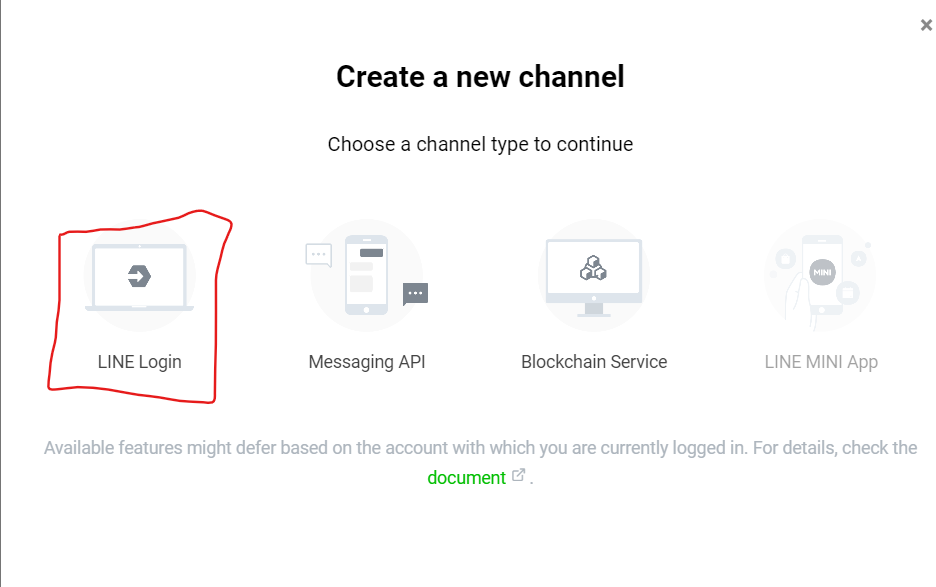
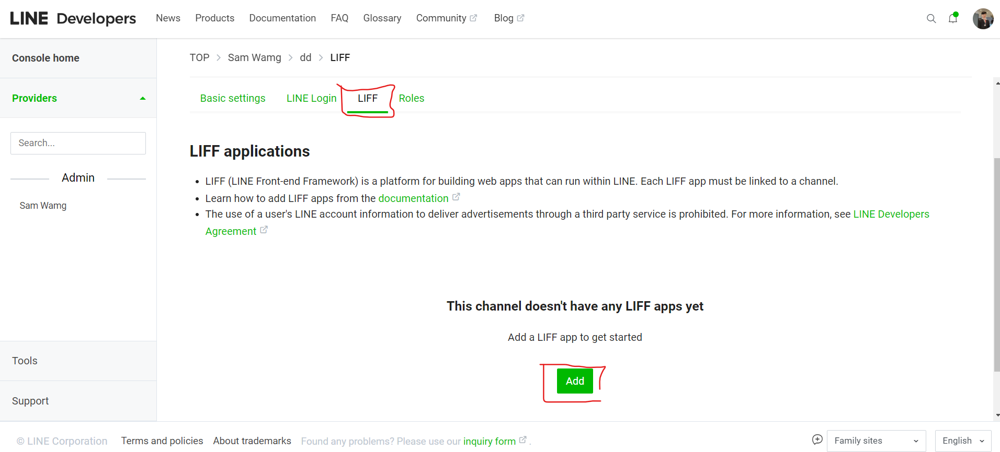
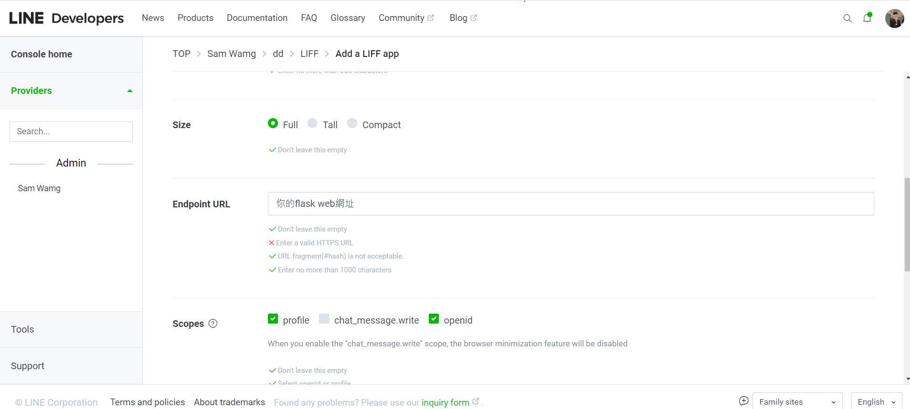
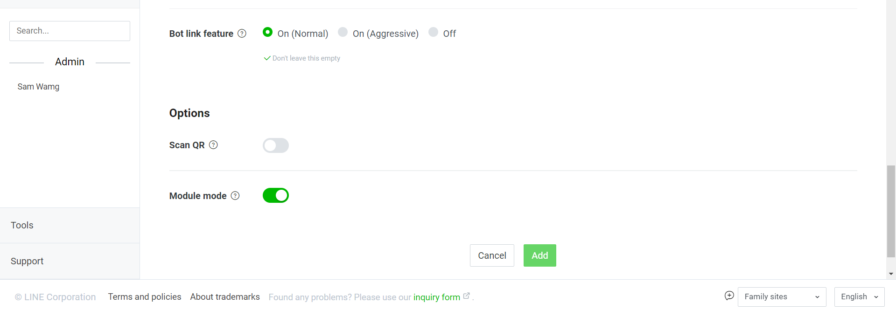
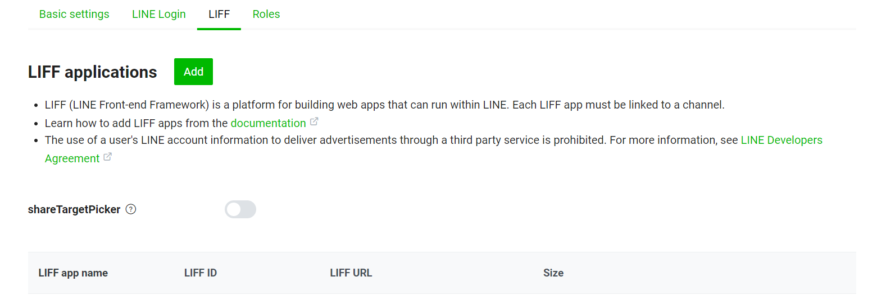
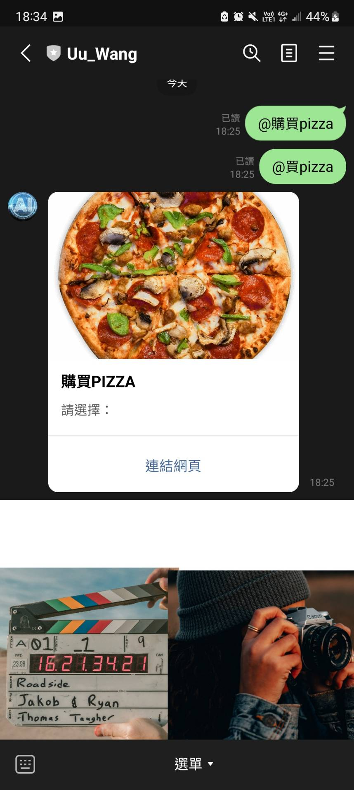
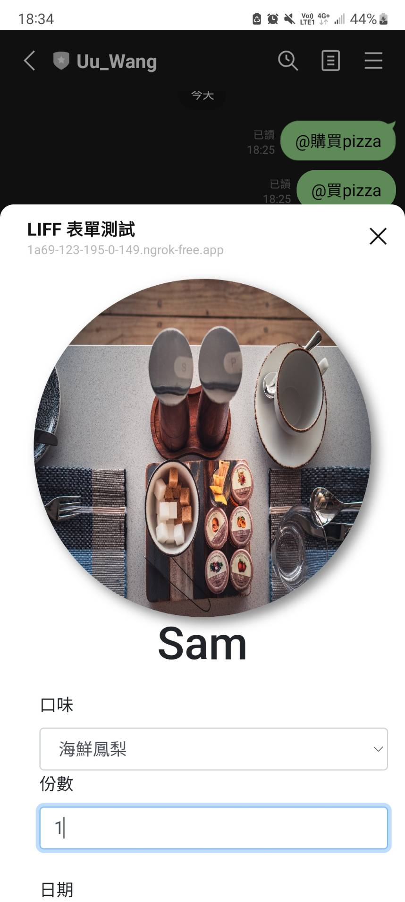

# Line Liff App
## 前言
今天若我們想要讓與用者可以透過line bot連到我們自己寫的額外網站會遇到兩個問題
1. 無法取得當前user是誰
2. 會需要跳轉置外網

然而Line提供一個功能叫Line Liff App讓我們可以在網頁上取得Line user的資訊以及不用跳轉網頁，今天就來實作一個簡易的Line Liff App吧!
[完整code]()

## 介紹
**LINE LIFF (LINE Front-end Framework)** 是 LINE 提供的一種開發工具，用於創建具有豐富用戶界面和交互功能的 Web 應用程序，並將它們嵌入到 LINE 應用中。 LIFF 允許開發者構建輕量級的 Web 應用，以與 LINE 用戶進行交互。以下是關於 LINE LIFF App 的一些關鍵信息：

1. **輕量級 Web 應用程序**: LIFF App 是輕量級的 Web 應用，可以嵌入到 LINE 應用中。它們使用常見的 Web 技術（HTML、CSS、JavaScript）構建。

 

3. **與 LINE 集成**: LIFF App 可以嵌入到 LINE 應用中，與 LINE 聊天界面無縫集成。用戶可以在 LINE 中使用這些應用程序，而不必離開聊天。

4. **使用 LINE 登錄**: 開發者可以利用 LINE 登錄功能，使用戶能夠使用他們的 LINE 帳戶登錄 LIFF 應用程序，這樣就不需要單獨的帳戶管理。

5. **實時通信**: 開發者可以使用 LIFF App 與用戶進行實時通信，例如發送消息、接收消息、處理事件等。

6. **自定義功能**: 開發者可以根據需要創建各種自定義功能，如查詢天氣、接收支付、創建任務清單等。

7. **數據存儲**: LIFF App 可以使用 Web 存儲或與後端服務器交互來存儲和檢索數據。

8. **跨平台**: LIFF App 可以在多個平台上運行，包括 iOS、Android 和 Web。

總的來說，LINE LIFF App 是一種非常靈活的方式，供開發者擴展 LINE 平台的功能，提供更多個性化的用戶體驗和服務。它適用於各種用例，包括社交、娛樂、商務、新聞和生產力工具等。開發者可以使用 LIFF 框架創建適用於 LINE 用戶的創新應用程序。

## 範例
### 創建Line Liff App
1. 先登入[Line開發者網頁](https://account.line.biz/login?redirectUri=https%3A%2F%2Fdevelopers.line.biz%2Fconsole%2Fprovider%2F1656368068%3Fstatus%3Dsuccess)
2. 選擇Line login

3. 像上次Message API填寫資料，接者到Liff頁面在按Add

4. 繼續在填寫資料
    * `Size`- 意思是在Line bot要顯示多大，Full為全螢幕顯示、Tall 為 70% 顯示、Compact 為 50% 顯示
    * `Endpoint URL`-你要讓user跳轉的page url，這裡我們要填寫自己flask web的URL
    * `Scopes`- LIFF App 內可以搜集的資訊，我們選擇profile和openid就好

5. option設定


最後按下Add就好
`LIFF ID` - 為你的認證碼要加在web裡面
`LIFF URL` - 為你的跳轉網頁URL

### python code
```python
 
from flask import Flask, request, abort,render_template

from linebot import (
    LineBotApi, WebhookHandler
)
from linebot.exceptions import (
    InvalidSignatureError
)
from linebot.models import *
import os
from urllib.parse import parse_qsl
#======python的函數庫==========

app = Flask(__name__)
info=[]
with open(os.path.join('..','key.txt'), 'r') as f:
    for line in f:
        info.append(line.strip())
LINE_CHANNEL_SECRET = info[0]
LINE_CHANNEL_ACCESS_TOKEN = info[1]
LIFF_ID = info[2]
LIFF_URL = info[3]
 

line_bot_api = LineBotApi(LINE_CHANNEL_ACCESS_TOKEN)
handler = WebhookHandler(LINE_CHANNEL_SECRET)
# 監聽所有來自 /callback 的 Post Request
@app.route('/page')
def page():
    return render_template('index.html', liffid = LIFF_ID)

@app.route("/callback", methods=['POST'])
def callback():
    # get X-Line-Signature header value
    signature = request.headers['X-Line-Signature']
    # get request body as text
    body = request.get_data(as_text=True)
    app.logger.info("Request body: " + body)
    # handle webhook body
    try:
        handler.handle(body, signature)
    except InvalidSignatureError:
        abort(400)
    return 'OK'

 
# 處理訊息
@handler.add(MessageEvent, message=TextMessage)
def handle_message(event):
    mtext = event.message.text
    if mtext == '@買pizza':
        message = TemplateSendMessage(
                alt_text='按鈕樣板',
                template=ButtonsTemplate(
                    thumbnail_image_url='https://i.imgur.com/4QfKuz1.png',  #顯示的圖片
                    title='購買PIZZA',  #主標題
                    text='請選擇：',  #副標題
                    actions=[
                        URITemplateAction(  #開啟網頁
                            label='連結網頁',
                            uri=LIFF_URL,
                        ),
                    ]
                )
            )
        
        try:
            line_bot_api.reply_message(event.reply_token, message)
        except:
            line_bot_api.reply_message(event.reply_token,TextSendMessage(text='發生錯誤！'))

 
@handler.add(MemberJoinedEvent)
def welcome(event):
    uid = event.joined.members[0].user_id
    gid = event.source.group_id
    profile = line_bot_api.get_group_member_profile(gid, uid)
    name = profile.display_name
    message = TextSendMessage(text=f'{name}歡迎加入')
    line_bot_api.reply_message(event.reply_token, message)
        

if __name__ == "__main__":
    port = int(os.environ.get('PORT', 5000))
    app.run(port=port,debug=True)

```
1. 首先，導入了必要的模塊和庫，包括 Flask、LineBot SDK 相關的模塊，以及處理文件操作和 URL 解析的庫。

2. 創建 Flask 應用程序實例 `app`。

3. 為了不要把ID透漏使用，我們將這些資訊放入`key.txt`裡接著用 `with open` 讀取 `key.txt` 得到 `LINE_CHANNEL_SECRET`、`LINE_CHANNEL_ACCESS_TOKEN`、`LIFF_ID` 和 `LIFF_URL`。

4. 初始化 LineBotApi 和 WebhookHandler，使用讀取的 `LINE_CHANNEL_SECRET` 和 `LINE_CHANNEL_ACCESS_TOKEN`。

5. 設置了一個路由 `/page`，用於渲染名為 `index.html` 的頁面，將 `LIFF_ID` 傳遞給頁面。

6. 設置了一個路由 `/callback`，用於接收 LINE 的 Webhook 請求。當收到請求時，會驗證請求的簽名，然後使用 `handler.handle` 處理請求的內容。

7. 在 `/callback` 路由下，定義了處理不同事件的函數。 `handle_message` 處理文本消息，如果用戶發送 `@買pizza`，則會回復一個包含按鈕的消息模板，點擊按鈕可以打開一個鏈接。

8. `welcome` 函數處理成員加入群組的事件，獲取新成員的用戶名並發送歡迎消息。

9. 在 `if __name__ == "__main__":` 中，啟動 Flask 應用，可以監聽指定的端口，以便可以接收 LINE 的 Webhook 請求。

### js
Line Liff API需使用js進行串接以下為串接code
```js
<script src="https://cdnjs.cloudflare.com/ajax/libs/jquery/3.0.0/jquery.min.js"></script>
<script src="https://static.line-scdn.net/liff/edge/2.1/sdk.js"></script>
    <script>
        var user_id;
        var name;
        var picUrl;
        function initializeLiff(myLiffId) {
            liff.init({
                liffId: myLiffId
            }).then(() => {
                if (!liff.isLoggedIn()) {
                    alert("用戶未登入");
                    liff.login();
                } else {
                    // alert("用戶已登入");
                    liff.getProfile()
                        .then(profile => {
                            name = profile.displayName;
                            userId = profile.userId;
                            picUrl = profile.pictureUrl;
                            const imgElement = document.getElementById("myImage");
                            document.getElementById("name").innerHTML = name;
                            imgElement.src = picUrl;
                        })
                        .catch((err) => {
                            console.log('error', err);
                        });
                }
            }).catch((err) => {
                console.log('初始化失敗', err);
            });
        }


        function pushMsg(pname, pdatatime, proom) {
            if (pname == '' || pdatatime == '' || proom == '') {  //資料檢查
                alert('每個項目都必須輸入！');
                return;
            }
        }
             

        $(document).ready(function () {
            initializeLiff('{{ liffid }}');  //接收傳遞的 liffid 參數
            $('#sure').click(function (e) {  //按下確定鈕
                pushMsg($('#name').val(), $('#datetime').val(), $('#sel_room').val());
            });
        });
    </script>
```
1. `<script src="https://static.line-scdn.net/liff/edge/2.1/sdk.js"></script>`：導入LINE Front-end Framework（LIFF）的JavaScript SDK，以便在網頁中使用LIFF 功能。
2. 在 `initializeLiff(myLiffId)` 函數中，使用 `liff.init()` 初始化 LIFF，傳遞了 `myLiffId`，這是 LIFF 應用的 ID。在初始化後，檢查用戶是否已登錄，如果未登錄，則彈出警告消息，並使用 `liff.login()` 方法引導用戶登錄。
3. 如果用戶已登錄，通過 `liff.getProfile()` 方法獲取用戶的基本資料，包括姓名、用戶 ID 和頭像 URL。然後，將用戶姓名顯示在 HTML 頁面中的 `name` 元素中，並設置頭像圖片的 URL，以便顯示用戶頭像。
4. 在 `pushMsg(pname, pdatatime, proom)` 函數中，對用戶輸入的內容進行檢查，確保每個項目都已輸入。如果有任何一個項目為空，將彈出警告消息。
5. `$(document).ready(function () { ... });`：這是 jQuery 代碼，用於在頁面加載完成後執行初始化操作。在這裡，`initializeLiff('{{ liffid }}')` 用於初始化LIFF，`$('#sure').click(function (e) { ... });` 用於監聽"確定" 按鈕的點擊事件，當用戶點擊按鈕時，將觸發`pushMsg` 函數進行數據檢查。

### html
```html
<style>
        /* 在<style>标签中添加 CSS 样式 */
        .rounded-image {
            border-radius: 50%;
        }

        .center-image {
            margin: 0 auto;
            display: block;
        }
        .shadowed-image {
            display: block;
            margin: 0 auto;
            box-shadow: 5px 5px 10px #888888; /* 阴影效果 */
        }
    </style>
</head>

<body>
    <div class="row" style="margin: 10px">
        <div class="center-image">
            
            <h1 id="name" style="text-align: center;"> </h1>
        </div>
        
        <div id="output"></div>
        <div class="col-12" style="margin: 10px">
            <label>口味</label>
            <select id="sel_room" class="form-control">
                <option selected>海鮮鳳梨</option>
                <option>墨西哥</option>
                <option>龍蝦沙拉</option>
            </select>
            <label>份數</label>
            <input type="text" id="name" class="form-control" />
            <br />
            <label>日期</label>
            <input type="date" id="datetime" value="" class="form-control" />
            <br />
            <button class="btn btn-success btn-block" id="sure">確定</button>
        </div>
    </div>
</body>
```
這應就不用多說明了
## 結果



## 後語
今天教導大家如何創建Liff app且透過Liff取得user的資訊，最後剩餘的五天我將實作一個可以辨識使用者所上傳的mp3 file是什麼歌。