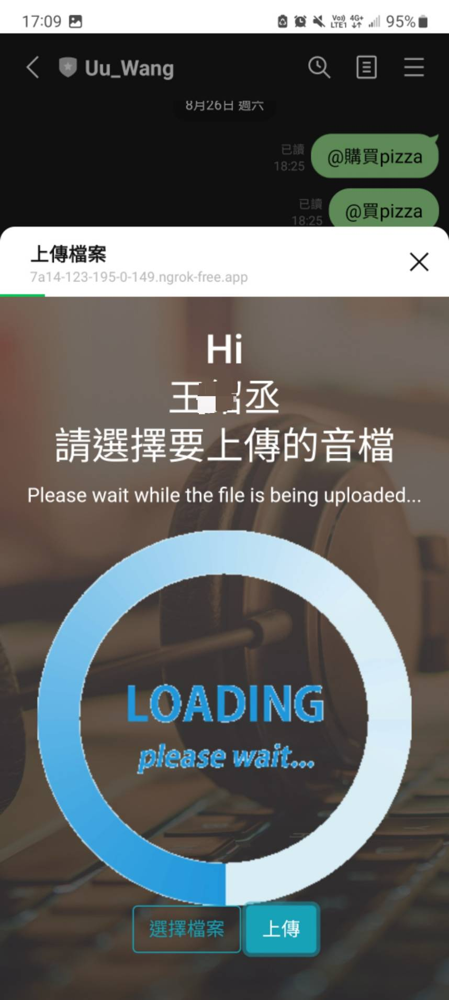
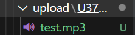

# Line bot 上傳檔案
## 前言
前幾天我們已經介紹了許多line message API的基本功能，接下來我將帶大家實作一個能辨識你所上傳的音檔是哪首歌的簡易專案，首先我們必須先實作出上傳檔案的功能。
## 介紹
首先讓我們來看看流程圖

相信這幾個功能除了辨識歌曲外大家都已經有辦法實作了，讓我來依序講述以下細節:
### 上傳檔案
與Day6、Day7教導的大致上一樣，只是我們必須結合Day25的Line Liff APP來去取得user的資訊才可以將每個user的資料分割以及回傳資訊給指定user。   
### 辨識歌曲
我們將使用ShazamAPI來達成至於具體使用會在明天教導大家
### 回傳資訊給指定user
透過`line_bot_api.push_message(user_id, message)`達成
* `user_id` - 每個user都有對應的ID由Line Liff取得
* `message` - 要傳達的訊息

## 範例
在實作前請先根據day25、day24的功能自行設定。
### python
這部分大致上跟day6、day7一樣，但多了
1. 取得line liff id
2. 以line liff ID創建user的專屬資料夾
3. 改成僅允許mp3、wav
```python
ALLOWED_EXTENSIONS = {'wav','mp3'}

def allowed_file(filename):
    return '.' in filename and filename.rsplit('.', 1)[1].lower() in  ALLOWED_EXTENSIONS
def get_filename(filename):
    return filename.split('.')[1]
@app.route('/upload', methods=['get'])
def uploads_page():    
     user_id= request.form.get('ID')     
     return render_template('index.html', liffid = LIFF_ID , user_id=user_id)
@app.route('/upload', methods=['POST'])
def upload_file():
    errorMsg=''
    musicname=''
    user_id= request.form.get('ID')
    upload_folder = os.path.join("static","upload",user_id)
    file = request.files['filename']    # 取得上傳的檔案 
    if get_filename(file.filename) == 'mp3' or get_filename(file.filename) == 'wav': 
        musicname=file.filename
        # return redirect(url_for('index'))   # 令瀏覽器跳回首頁 
    if file and allowed_file(file.filename):   # 確認有檔案且副檔名在允許之列'
        os.makedirs(upload_folder ,exist_ok=True)
        file.save(os.path.join(upload_folder, file.filename))
    else:
        errorMsg='僅允許上傳mp3、wav音檔'
    return render_template('index.html',errorMsg=errorMsg,filename=file.filename,img_name=musicname,liffid = LIFF_ID,user_id=user_id)

```
### html
算是把day25、day7做一個整合
```html
<form method="POST" enctype="multipart/form-data" action="{{ url_for('upload_file') }}"
        onsubmit="return checkSubmit(this)">
        <div id="wait" style="display:none">
            <p style="color: white;">Please wait while the file is being uploaded...</p>
            
        </div>
        <button class="btn btn-outline-info" onclick="document.getElementById('getFile').click()"value="select" name="select">選擇檔案</button>
        <input type="file" id="getFile" style="display:none" name="filename"  required>
        <input type="text" id="user_id" name="ID" style="display: none;" >
        <input type="submit" class="btn btn-outline-info" value="上傳" onclick="onUploadButton()">
        <h1><label id="file-name"></label></h1>

    </form>
    <script>
    liff.getProfile()
            .then(profile => {
                name = profile.displayName;
                user_id = profile.userId;
                picUrl = profile.pictureUrl;
                const imgElement = document.getElementById("myImage");
                document.getElementById("name").innerHTML = name;
                var inputElement = document.getElementById('user_id');
                // 設置 input 元素的值
                inputElement.value = user_id;
                imgElement.src = picUrl;
            })
            .catch((err) => {
                console.log('error', err);
            });
    </script>
```

`input type="text" id="user_id" name="ID" style="display: none;"`：用於存儲用戶的 Liff ID（user_id），並將其傳遞給flask創建專屬資料夾，但為了不要讓使用者看到 使用`style="display: none;"` 使其看不見，此外是透過 JavaScript 將用戶的 ID 設置為該輸入框的值。
```html
 <button class="btn btn-outline-info" onclick="document.getElementById('getFile').click()"value="select" name="select">選擇檔案</button>
<input type="file" id="getFile" style="display:none" name="filename"  required>`
```
預設的上傳檔案扭很醜，但是又沒辦法直接對input file tag做太大改動，於是我將其隱藏，並賦予其他button點擊同等於啟動該input file tag。 

### css
為了讓專案好看一點有額外調整
```css
header.upload {
    padding-top: 10rm;
    padding-bottom: calc(10rem - 4.5rem);
    background: linear-gradient(to bottom, rgba(92, 77, 66, 0.8) 0%, rgba(39, 34, 32, 0.8) 100%), url("../back.jpg");
    background-position: center;
    background-repeat: no-repeat;
    background-attachment: scroll;
    background-size: cover;
    /* height: 85vh; */
  }
```

## 結果
### 上傳中

### 檔案格式錯誤

### 上傳完畢



## 結語
我們在今天教導大家先實現了上傳音檔的功能，至於明天就讓我介紹ShazamAPI以及如何使用吧!