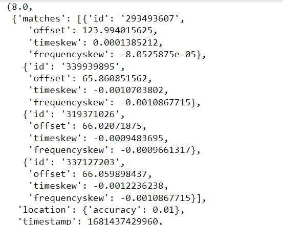
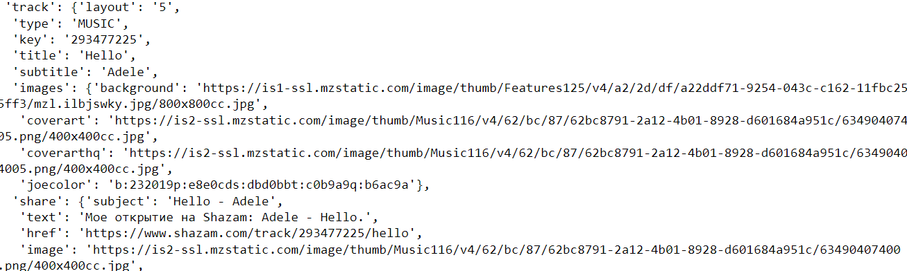

# ShazamAPI
## 前言
在昨天我們已經將上傳檔案與line bot的串接建置完畢，接下來則是遇到一個痛點，要如何辨識歌曲呢?如果要自己訓練模型那本次的IT鐵人賽就會變成機器學習教學了(笑 還好有現成的API可以使用那就是ShazamAPI!!!
## 介紹
[ShazamAPI](https://github.com/marin-m/SongRec) 是一個音樂識別 API，它可以讓您的應用程序識別音樂並連接到 Shazam 的音樂目錄。您可以使用 ShazamAPI 來豐富您的應用程序體驗，讓用戶找出歌曲的名稱、演唱者、流派等信息。 

ShazamAPI 提供了多種 REST API 端點，可以暴露 Shazam 的所有功能。例如，它提供了端點，允許根據原始音樂數據檢測歌曲，根據短語搜索歌曲，提供歌曲推薦，按國家列出熱門曲目等。

ShazamAPI 的目標受眾通常是在音樂或娛樂應用程序上工作的開發人員。這些開發人員可以使用 ShazamAPI 端點通過移動/網頁/桌面應用程序為其用戶提供音樂相關服務。

ShazamAPI 通過對音頻數據進行分析，生成音頻，然後將其與 Shazam 的音樂目錄中的數百萬首歌曲進行匹配，以識別歌曲。

此外他還提供[pip套件](https://pypi.org/project/ShazamAPI/)
### 價錢
* 基本版：每月 $0.00 美元，500次請求
* 專業版：每月 $20.00 美元，5000次請求
* 超級版：每月 $50.00 美元，15000次請求
* 超級版：每月 $500.00 美元，無限制


### 支援語言
ShazamAPI 支持多種語言，包括英語、法語、西班牙語、德語、意大利語、日語、韓語、俄語、印地語、荷蘭語、土耳其語、烏克蘭語、中文（簡體）、葡萄牙語和希伯來語。

## 範例
### 安裝
先將package裝下來
```shell
pip install ShazamAPI
```
### python
```python
from ShazamAPI import Shazam

mp3_file_content_to_recognize = open('你的音檔位置').read()

shazam = Shazam(mp3_file_content_to_recognize)
recognize_generator = shazam.recognizeSong()
t = next(recognize_generator)
print(t)
```

我們會發現他有相當多的資訊，然而我們在繼續往下看會找到track

這個幾本上就是我們會用到的資訊，經過解析後可以得到以下結果：
* `t[1]['track']['title']` - 歌曲
* `t[1]['track']['subtitle']` - 歌手名字
* `t[1]['track']['sections'][1]['text']` - 完整歌詞
* `t[1]['track']['images']['background']` - 歌手的照片


## 結語
有了這些資訊後我們就能將其串在line bot了，明天就讓我們來串結巴，我將會把他以card的方式回傳給上傳的使用者，此外ShazamAPI還有提供很多資訊大家有興趣可以去探索。