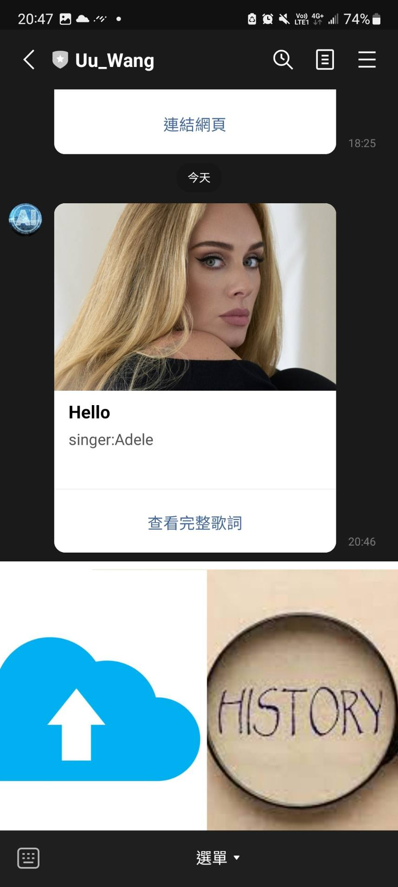

# Line bot 上傳檔案
## 前言
辨識歌曲、上傳檔案、回傳資訊我們都各別教過了，今天就讓我們來將期都串結吧!
## 範例
應該不用再介紹啥了，直接來吧
### flask
```python
t=time.time()
r=random.randrange(0, 101, 2)
upload_folder = os.path.join("static","upload",user_id,str(t)+str(r))
detect_song(upload_folder,musicname)
    
while(1):
    if(os.path.isfile(upload_folder+'/output.txt')):
        break
send_response_to_line_bot(user_id,'檔案上傳已完成',filedir=os.path.join(upload_folder, 'output.txt'))
```
我們在檔案上傳完成後便開始辨識，此外辨識是否完畢由`output.txt`判定，該文檔會在辨識完畢後將資訊寫入，故使用無窮迴圈將其卡住直到檔案出現為止，此外為了讓每個音檔都是獨立的我們修改了儲存path。
### 辨識歌曲
```python
def detect_song(path,filename):
    output = os.path.join(path,"output.txt")
    fp = open(output,'w')
    print('---------------',path,'--------------------------------')
    print("Files and Directories in '% s':" % path)
    inputfile=os.path.join(path,filename)
    mp3_file_content_to_recognize = open(inputfile, 'rb').read()
    shazam = Shazam(mp3_file_content_to_recognize)
    recognize_generator = shazam.recognizeSong()
    t = next(recognize_generator)
    print('song title',t[1]['track']['title'],'\nsinger',t[1]['track']['subtitle'],'\nlyric',t[1]['track']['sections'][1]['text'])
    song_title = 'song title:' + t[1]['track']['title']
    singer = '\nsinger:' + t[1]['track']['subtitle']
    image = '\nimage:' + t[1]['track']['images']['background']
    fp.write(song_title)
    fp.write(singer)
    fp.write(image)
    fp.write('\nlyric:')
    for l in t[1]['track']['sections'][1]['text']:
        fp.write(l)
    fp.close()
```
1. 接收兩個參數 path 和 filename，path 表示音檔所在的目錄，filename 表示音頻文件的文件名。
2. 創建一個名為 output.txt 的文本文件，該文件用於存儲檢測到的歌曲信息。
3. 使用 Shazam 技術對指定的音頻文件進行識別。 Shazam 是一種廣泛用於音樂識別的技術，它可以識別音頻文件中的歌曲信息，包括歌曲標題、歌手、專輯等。
4. 獲取識別結果，並從中提取歌曲的相關信息，如歌曲標題、歌手、歌詞和背景圖片等。
5. 將提取到的歌曲信息寫入 output.txt 文件中，包括歌曲標題、歌手、圖片 URL 和歌詞。

### 傳送訊息給使用者
```python
def send_response_to_line_bot(user_id, message,filedir):
    ryric=''
    info=[]
    cnt=0
    f = open(filedir,'r')  
    for line in f.readlines():
        cnt+=1
        if(cnt>=4):
            ryric+=str(line)
        info.append(line)
    f.close
    picUrl=str(info[2])
    title=str(info[0])
    title=title[11:len(title)-1]
    link=picUrl[6:len(picUrl)-1]
    message = TemplateSendMessage(
        alt_text='按鈕樣板',
        template=ButtonsTemplate(
            thumbnail_image_url=link,  #顯示的圖片
            title=title,  #主標題
            text=info[1],  #副標題
            actions=[
                PostbackTemplateAction(
                            label='查看完整歌詞',
                            data=f'!歌詞{filedir}'
                ),
                    
            ]
        )
    )
    line_bot_api.push_message(user_id, message)

```
這個函數的主要作用是向 LINE Bot 用戶推送一個包含音樂信息的消息模板。函數接受三個參數：

1. `user_id`: 表示 LINE Bot 用戶的唯一標識符，用於確定向哪個用戶推送消息。

2. `message`: 一個消息對象，其中包含了音樂信息以及一些操作按鈕。這個消息會以模板形式發送給用戶。

3. `filedir`: 包含音樂信息的文本文件的路徑。函數會從這個文件中讀取音樂信息，包括歌曲標題、副標題、圖片鏈接等。

函數的具體操作如下：

1. 打開指定路徑的文本文件（`filedir`）以讀取文件內容。

2. 通過逐行讀取文件內容，將每一行的內容添加到 `info` 列表中。同時，統計讀取的行數，當行數大於等於 4 時，將文件內容拼接到 `ryric` 字符串中。 

3. 關閉文件。

4. 從 `info` 列表中獲取音樂信息，包括歌曲標題、副標題、圖片鏈接。這些信息可能存儲在 `info` 列表的特定索引位置。

5. 構建一個消息模板 (`ButtonsTemplate`)，其中包含了音樂信息，包括標題、副標題、圖片鏈接，並添加了一個按鈕，用於查看完整歌詞。

6. 使用 `line_bot_api.push_message()` 方法將消息模板發送給指定的用戶（通過 `user_id` 指定的用戶）。

## 結果

## 結語
如果大家有真的實作出來應該有發現完整歌詞的功能尚未實作出來，因此明天將帶大家實作，此外我已經建立了一個資料夾存放所有上傳過的歌曲，那麼是否可以查詢歷史紀錄呢?這個功能也將在明天帶大家展示~

