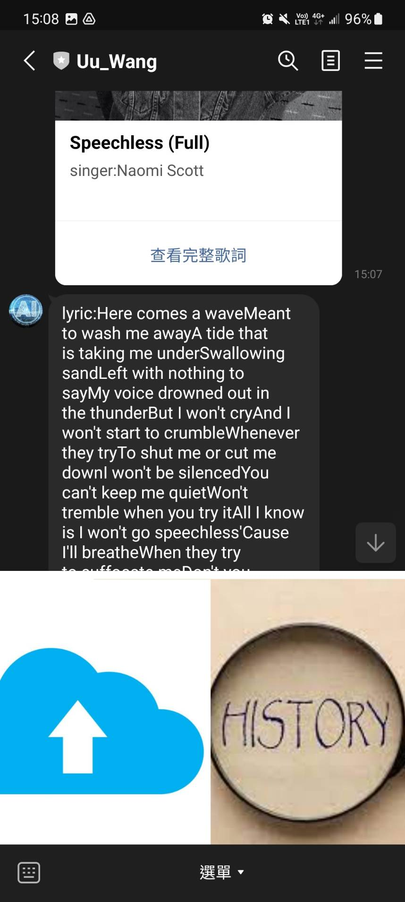

# Line bot 上傳檔案
## 前言
目前還有完整歌詞跟歷史紀錄尚未完成，今天就讓我們繼續完成這個project吧!
## 範例
### 完整歌詞
* PostbackTemplateAction
    ```python
    PostbackTemplateAction(
        label='查看完整歌詞',
        data=f'!歌詞{output_path[i]}'
    ),
    ```
    我們先在`PostbackTemplateAction`的button中賦予傳送data的功能，而這個data要加上有紀錄完整歌詞txt檔案的位置。
* PostbackEvent
    ```python
    @handler.add(PostbackEvent)
    def handle_postback(event):
        lyrics=''
        cnt=0
        postback_data = event.postback.data
        if '!歌詞' in postback_data:
            filename=postback_data[3:]
            f = open(filename,'r')  
            for line in f.readlines():
                cnt+=1
                # print('--------',cnt,'---------')
                if(cnt>=4):
                    lyrics+=str(line)
            f.close
            line_bot_api.reply_message(
                event.reply_token,
                TextSendMessage(text=lyrics)
            )
         
    ```
    1. 剛才由`PostbackTemplateAction`傳送的data可以由新增`PostbackEvent`事件接收該data，並透過`event.postback.data`取得該數據。
    2. 因為剛才傳送的data為完整歌詞的path所以我們只要把剛檔案的完整歌詞讀出來並且reply回去就好，因為可能之後在加更多功能後會有多個data所以我們用`!歌詞`來做區分。

### 歷史紀錄
* 新增`@歷史紀錄`
```python
if mtext == '@歷史紀錄':
    singer, song, picUrl, output_path = history(userID)
    columns = []
    # print(singer,song,melody,lyrics,picUrl)
    for i in range(len(song)):
        columns.append(CarouselColumn(
            thumbnail_image_url=picUrl[i],
            title=song[i],
            text=singer[i],
            actions=[
                
                PostbackTemplateAction(
                    label='查看完整歌詞',
                    data=f'!歌詞{output_path[i]}'
                ),
                    
            ]
        ))
    message = TemplateSendMessage(
        alt_text='轉盤樣板',
        template=CarouselTemplate(
            columns=columns
        )
    )
```
1. `history`待會會在下面詳細解釋，它的功能就只是把該user的資料夾做尋訪，然後把所有檔案的歌手、歌詞、完整歌詞的path包裝成list使用。
2. 把該資訊用append的方式一一擴增我們的columns，接著把這個columns賦予給`CarouselTemplate`這樣就完成多個card的設定了。

* history
    ```python
    def history(userID):
        singer=[]
        song=[]
        staticpath=os.path.join('static','upload')
        picUrl=[]
        url=''
        output_path=[]
        path=staticpath + '\\' + userID + '\\'
        obj = os.scandir(path)
        for entry in obj :
            cnt=0
            me=''
            ly=''
            info = path + entry.name + '\\output.txt'
            print(info)
            if(os.path.isfile(info)):
                output_path.append(info)
                with open(info, "r") as file:
                    for line in file:
                        if(cnt==0):
                            song.append(line.strip())
                        if(cnt==1):
                            singer.append(line.strip())
                        if(cnt==2):
                            url=line.strip()
                            picUrl.append(url[6:len(url)])
                        cnt+=1
                file.close
            
            
            
                
        # print(song,singer,picUrl,url)
        return singer,song,picUrl,output_path
    ```
    1. 我們透過`os.scandir(path)`去尋訪該用戶得資料夾，`entry.name`會是該資料夾裡面的子檔案名字，剩餘的就只是把剛才辨識完成的`output.txt`的info讀出來。
    2. 最後把每個info分群append到list中在return回去就好。

## 結果
### 完整歌詞

### 歷史紀錄


## 結語
這個project大致上就完成了啦，若大家有興趣也可以透過歌詞或旋律去推薦只使用者類似的歌，此外每次都用ngrok其實有點麻煩，在這也推薦一個服務，[render.io](https://render.com/)，他有提供免費的服務可以讓我們的code push到他們的網域上，類似heroku(可惜heroku要收錢了)，如果大家有興趣我可以在明天教大家如何布置。