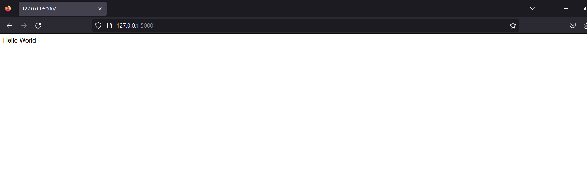

# 如何建置flask web
## 前言
在上一天我們已經用範例與優缺解釋選擇為什麼選擇flask了，接下來讓我們著重在學習吧，有寫過程式的人可想而知都會從Hello World開始，所以我們叫來寫一個flask版本的hello world吧!
## 環境
```
# 安裝套件
pip install flask
```
## 範例
Flask 的路由方法是一種用於將 URL 路徑映射到應用程序中的函數的技術。它讓你能夠定義不同 URL 路徑的行為，例如根據用戶請求的 URL 返回不同的頁面或數據。

在 Flask 中，可以使用 @app.route 裝飾器來定義路由。這個裝飾器可以應用在函數上，並指定函數處理的 URL 路徑。

下方所對應的function就是這個url要做的事情。
```python

# 選定自己要的資料夾，在裡面手動新增app.py並加上以下幾行code
from flask import Flask
app = Flask(__name__)
@app.route("/")
def hello():
    return 'Hello World'
if __name__ == '__main__':
    app.debug = True
    app.run()
# 啟動app.py
python app.py
#會創建一個http://127.0.0.1:5000/的網站
```
在這個例子中，我們定義了兩個路由。@app.route('/') 表示根 URL，也就是網站的首頁。當用戶訪問根 URL 時，Flask 會調用 index 函數並返回 'Hello, World!'。
## 結果
在瀏覽器輸入127.0.0.1:5000便會看到hello world，這是因為flask會開啟一個5000 port的服務。

## 總結
接下來筆者會帶大家使用flask做一些基本功能、畫股市k線、line bot專案，以下為本次30天目錄。
1.	why flask?
2.	如何建置flask web
3.	如何綁定html和設定路由
4.	將python語法套入html 好用的Jinja2 
5.	post get
6.	上傳檔案
7.	例外處理
8.	Sqllite
9.	Flask login
10.	Login require current_user.is_authenticated getuserid
11.	註冊
12.	管理者介面
13.	API
14.	Blueprint
15.	Blueprint URL
16.	Plotly與flask
17.	爬蟲大盤資訊
18.	劃出5分k
19.	Line bot ngrok
20.	Send text 貼圖、圖片
21.	卡片LocationSendMessage
22.	傳送影片、因檔
23.	@handler.add(PostbackEvent)
24.	Line 下方圖片
25.	上傳檔案
26.	辨識歌
27.	辨識歌加上卡片
28.	歷史紀錄
29.	完正歌詞
30.	結語
