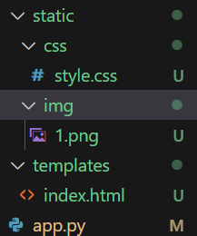
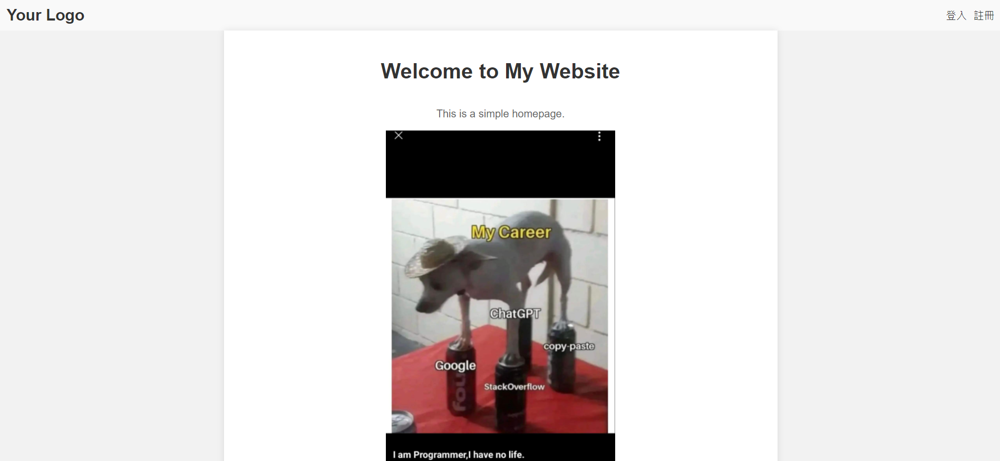

# 如何綁定html 
## 前言
昨天提到如何配置環境和一個能print hello world的flask web，今天讓我們來談談如何綁定html和設定路由吧
## 綁定html
### python
有兩種方法:
1. 直接return html code
```python
# app.py直接return html code
from flask import Flask
app = Flask(__name__)
@app.route("/")
def index():
    return "<h2>Got it!</h2>"
if __name__ == '__main__':
    app.debug = True
    app.run()
```
但是上述方法當html過長時code會很醜所以提供第二種
2. 使用`render_template()`
render_template() 函數用於將動態數據與 HTML 模板結合，生成最終的 HTML 頁面。它是 Flask 框架中的一個重要功能，用於實現動態網頁的呈現。你可以將數據從 Python 代碼傳遞給 HTML 模板，並在模板中使用特定的語法來動態生成內容。

在使用 render_template() 函數時，首先需要確保專案中存在一個名為 "templates" 的資料夾，該資料夾用於存放 HTML 模板文件。接著，你可以在路由處理函數中使用 render_template() 函數來指定要渲染的模板文件和傳遞給模板的數據。
```python
from flask import Flask,render_template
app = Flask(__name__)
@app.route("/")
def index():
    return render_template('index.html')
if __name__ == '__main__':
    app.debug = True
    app.run()
```
### html
接著是html我使用chatgpt生成一個簡易首頁當範例，但要注意html、css、js、img會更以前不太一樣目錄位置如下:


首先需要再有app.py的目錄下創建兩個資料夾，分別為
1. 剛剛提到的templates用來放html
2. static用來放css、js、img

這樣flask才找得到html跟css、js、img
此外在html引進的方法也變了，要透過
`href="{{ url_for('static', filename='css/style.css') }}"`的方式以下為範例:

```html
<!DOCTYPE html>
<html>
<head>
    <title>首頁</title>
     
        <link type="text/css" rel="stylesheet" href="{{ url_for('static', filename='css/style.css') }}"/>
        <!-- 注意上方引入方式 -->
   
</head>
<body>
    <header>
        <div class="logo">
            Your Logo
        </div>
        <div class="nav">
            <a href="/login">登入</a>
            <a href="/register">註冊</a>
        </div>
    </header>

    <div class="container">
        <h1>Welcome to My Website</h1>
        <p>This is a simple homepage.</p>
        
        <!-- 注意上方引入方式 -->
    </div>

    <footer>
        &copy; 2023 Your Company. All rights reserved.
    </footer>
</body>
</html>

```
### css
因為主軸是flask在這裡就不對css做說明
```css
body {
    background-color: #f2f2f2;
    font-family: Arial, sans-serif;
    margin: 0;
    padding: 0;
}

.container {
    max-width: 800px;
    margin: 0 auto;
    padding: 20px;
    background-color: #ffffff;
    box-shadow: 0 0 10px rgba(0, 0, 0, 0.1);
    height: 100vh;
    display: flex;
    flex-direction: column;
    align-items: center;
    justify-content: center;
    /* 其他樣式設定 */
}

header {
    display: flex;
    align-items: center;
    justify-content: space-between;
    padding: 10px;
    background-color: #f9f9f9;
}

.logo {
    font-size: 24px;
    font-weight: bold;
    color: #333333;
}

.nav {
    display: flex;
    align-items: center;
}

.nav a {
    margin-left: 10px;
    color: #333333;
    text-decoration: none;
}

h1 {
    color: #333333;
    margin-top: 20px;
}

p {
    color: #666666;
}

footer {
    text-align: center;
    background-color: #f9f9f9;
    padding: 10px;
    margin-top: 20px;
}
```

## 成果

## 總結
今天的教學到這裡啦，明天將帶大家使用Jinja2讓python語法能在html中使用!