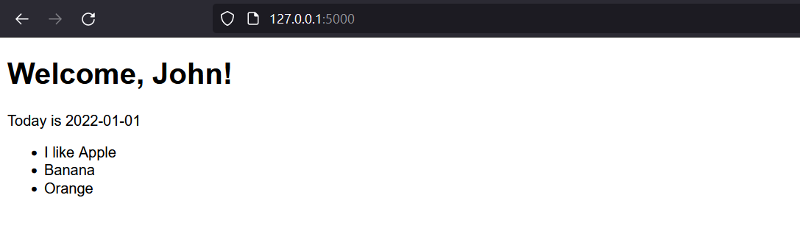

# 好用的Jinja2 將python語法套入html 
## 前言
昨天學會了綁定html後，今天來教大家如何在html使用python語法以及將python變數傳到html，方法就是透過Jinja2來達成。
## 介紹
Jinja2 是一個強大的 Python 模板引擎，可用於在 HTML 文件中嵌入 Python 代碼，並實現動態生成內容。以下是我對 Jinja2 的介紹和舉例：
### Jinja2 簡介：
Jinja2 是一個為 Python 設計的模板引擎，它使用一種稱為模板的文件來定義動態生成的內容。模板是一個包含變量、運算式和控制結構的文件，它們允許你將 Python 代碼嵌入到 HTML 文件中，從而實現根據特定邏輯動態生成內容。

### Jinja2 的優點：
1. 簡潔易讀：Jinja2 的模板語法簡潔易讀，易於理解和編寫。
2. 靈活性：Jinja2 支持各種控制結構和運算式，使你能夠靈活地根據需求定制動態內容。
3. 安全性：Jinja2 提供安全性特性，可以防止常見的安全漏洞，例如跨站腳本 (XSS) 攻擊。

### Jinja2 的使用舉例：
假設你有一個 Flask 應用程序，你可以在 HTML 文件中使用 Jinja2 來動態生成內容。以下是一個簡單的例子：

```html
<!-- index.html -->
<!DOCTYPE html>
<html>
<head>
    <title>Welcome</title>
</head>
<body>
    <h1>Welcome, {{ username }}!</h1>
    <p>Today is {{ date }}</p>
</body>
</html>
```

在這個例子中，我們使用 `{{ }}` 來包裹 Jinja2 變量，`username` 和 `date` 是從 Python 代碼中傳遞到模板中的變量。你可以在 Python 代碼中設置這些變量的值，然後使用 Jinja2 渲染模板：

```python
# app.py
from flask import Flask, render_template

app = Flask(__name__)

@app.route('/')
def index():
    username = 'John'
    date = '2022-01-01'
    return render_template('index.html', username=username, date=date)

if __name__ == '__main__':
    app.run()
```

在上面的例子中，當你訪問應用程序的根路由時，Flask 會呼叫 `index` 函式，並使用 `render_template` 方法渲染 `index.html` 模板。在 `render_template` 方法中，我們傳遞了 `username` 和 `date` 變量，它們會在模板中被替換

為相應的值。

當你運行 Flask 應用程序並訪問根路由時，你應該能夠看到動態生成的內容，其中包含用戶名和當前日期。

此外for跟if也通用，在 Jinja2 的模板中使用 for 迴圈時，你可以遍歷一個可迭代對象並生成相應的內容。以下是一個 for 迴圈的範例：

```html
<ul>
  
  {% if item=='apple' % }
    <div>I like</div>
    
    <li>{{ item }}</li>
  
</ul>
```

在這個範例中，我們使用了 `` 和 `` 來標記 for 迴圈的開始和結束。`items` 是一個可迭代對象，例如列表或字典的鍵值。在每次迭代中，我們使用 `{{ item }}` 來顯示該項目的值，以及``和``做了基本的判斷。

你可以在 Python 代碼中傳遞 `items` 變量的值，然後使用 Jinja2 渲染模板。以下是一個簡單的 Python 程式碼示例：

```python
from flask import Flask, render_template

app = Flask(__name__)

@app.route('/')
def index():
    items = ['Apple', 'Banana', 'Orange']
    return render_template('index.html', items=items)

if __name__ == '__main__':
    app.run()
```

在這個例子中，我們定義了一個列表 `items` 包含三個水果名稱。在 Flask 應用程序的根路由中，我們將 `items` 變量傳遞給模板，並使用 Jinja2 渲染 `index.html`。

當你運行 Flask 應用程序並訪問根路由時，你應該能夠看到一個帶有三個項目的無序列表，每個項目對應一個水果名稱以及當顯示Apple時會額外多出I like的字。

## 成果

## 總結
今天教大家Jinja2的相關語法，接下來會教導大家如何使用post、get來讓html form與flask做溝通。