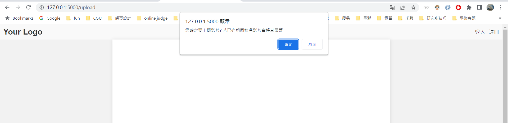
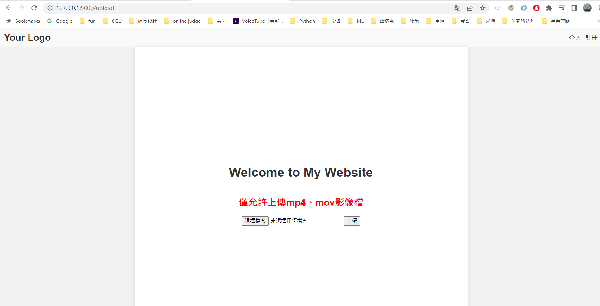

# 上傳檔案(2)
## 前言
在昨天的範例中我們已經學會使用簡易的上傳檔案，今天我要教大家，確認上傳鍵、檔案類型限制等。
[完整code在這裡]()
## 範例
### 首先來確認上傳確認鍵
1. 這裡我們使用js
```javascript
function onUploadButton() {
    msg = '您確定要上傳影片? 若已有相同檔名影片會將其覆蓋';
}
function checkSubmit() {
    if (confirm(msg)) {
        document.getElementById("wait").style.display = "block";
        document.getElementById("fin").style.display = "none";
        return true;
    }
    else {
        return false;
    }
}
```
在 JavaScript 部分，有兩個函數：`onUploadButton()` 和 `checkSubmit()`。

`onUploadButton()` 函數在上傳按鈕被點擊時被觸發，它設置了一個 msg 變量，用於確認是否要上傳影片的彈出提示框中的消息。

`checkSubmit()` 函數在表單提交時被觸發，它檢查是否確認要上傳影片，如果確認則顯示等待訊息，並隱藏完成訊息，然後返回 true，允許表單提交。如果取消上傳，則返回 false，阻止表單提交。

2. 接者在 `Day-6的HTML` 將form改掉：
```html
   <form method="POST" enctype="multipart/form-data" action="{{ url_for('upload_file') }}"
        onsubmit="return checkSubmit(this)">
        <div id="wait" style="display:none">
            <p>Please wait while the file is being uploaded...</p>
            
        </div>
        <input type="file" id="getFile"  name="filename" required>
        <input type="submit" class="btn btn-outline-info" value="上傳" onclick="onUploadButton()">
        <h1><label id="file-name"></label></h1>

    </form>
```
表單部分使用了 Flask 提供的模板語言功能，包括：

    method="POST" 表示表單使用 POST 方法提交。
    enctype="multipart/form-data" 表示表單包含文件上傳字段。
    action="{{ url_for('upload_file') }}" 指定表單提交的目標路由為 upload_file。
    onsubmit="return checkSubmit(this)" 表示在表單提交之前調用 checkSubmit() 函數進行檢查。

在表單內部，有一個文件上傳字段和一個提交按鈕。另外還有一個標籤用於顯示已選擇的文件名。

### 在來我們來實作快閃圖片和錯誤警訊
1. 在 Flask添增function和判斷：
```python

# app.py
from flask import Flask, render_template,request,flash
import pathlib
import os
app = Flask(__name__)
SRC_PATH =  pathlib.Path(__file__).parent.absolute()
UPLOAD_FOLDER = os.path.join(SRC_PATH,'static','uploads')
ALLOWED_EXTENSIONS = {'mp4','png'}
def allowed_file(filename):
    return '.' in filename and filename.rsplit('.', 1)[1].lower() in  ALLOWED_EXTENSIONS
def get_filename(filename):
    return filename.split('.')[1]
@app.route('/upload', methods=['get'])
def uploads_page():    
     return render_template('upload.html')
@app.route('/upload', methods=['POST'])
def upload_file():
    errorMsg=''
    imgname=''
    file = request.files['filename']    # 取得上傳的檔案 
    if get_filename(file.filename) == 'png' or get_filename(file.filename) == 'jpg': 
        imgname=file.filename
        # return redirect(url_for('index'))   # 令瀏覽器跳回首頁 
    if file and allowed_file(file.filename):   # 確認有檔案且副檔名在允許之列'
        os.makedirs(UPLOAD_FOLDER ,exist_ok=True)
        file.save(os.path.join(UPLOAD_FOLDER, file.filename))
    else:
        errorMsg='僅允許上傳mp4、mov影像檔'
    return render_template('upload.html',errorMsg=errorMsg,filename=file.filename,img_name=imgname)

if __name__ == '__main__':
    app.run(debug=True)
```
建立了 Flask 應用程式的實例，並設定了一些常數和變數：

    SRC_PATH：表示程式碼所在的絕對路徑。
    UPLOAD_FOLDER：指定上傳檔案的存儲目錄。
    ALLOWED_EXTENSIONS：設定允許上傳的檔案類型的集合。
    allowed_file() 函式：用於檢查上傳的檔案是否屬於允許的檔案類型。
    get_filename() 函式：用於獲取檔案名稱的副檔名。

接下來，定義了兩個路由：

    /upload 路由，對應 GET 方法。當用戶訪問該路由時，將渲染並返回 upload.html 模板。
    /upload 路由，對應 POST 方法。當用戶提交文件上傳表單時，將根據表單中的內容進行處理。首先，獲取上傳的檔案，檢查檔案類型是否符合允許的檔案類型。如果符合，則在指定的上傳目錄中保存檔案。如果不符合，則設置一個錯誤訊息。最後，將 upload.html 模板渲染並返回，同時傳遞錯誤訊息和檔案名稱。

最後，檢查程式是否直接運行，如果是，則啟動 Flask 應用程式並進入 debug 模式。
2. 在html新增Jinja2 
```html

<h2 style="color:red;"> {{ errorMsg|safe }} </h2>


<label>{{filename}}已上傳</label>



<!-- 如果filename變數值不是空的，則顯示影像。 -->
<div>
    
</div>

```
HTML 部分包含了一些條件判斷和動態內容的渲染。

    如果有 errorMsg 變數，則顯示一個紅色的錯誤訊息。

    如果有 filename 變數，則顯示該檔案已上傳的標籤。

    如果有 img_name 變數，則顯示一個影像元素，其 src 屬性指向靜態資源目錄中的影像檔案。

## 結果
### button確認

### 錯誤訊息

### 快閃圖片

 
## 總結
今天的篇幅稍微長，但也教大家比較實用的範例，整體上，今天實現了一個簡單的文件上傳功能，用戶可以通過訪問 /upload 路由來上傳檔案，並在頁面上顯示相應的訊息和上傳的影像檔案。
至於檔案上傳到此為止，明天將為大家介紹例外處理。