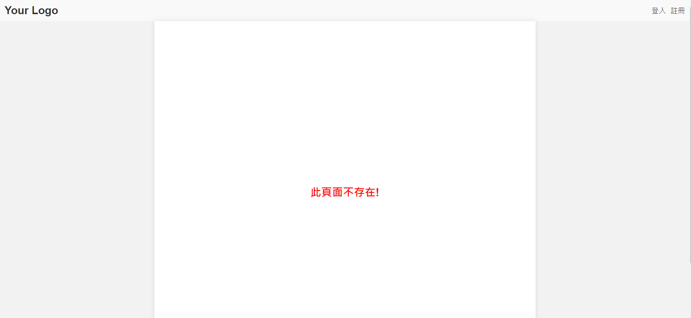
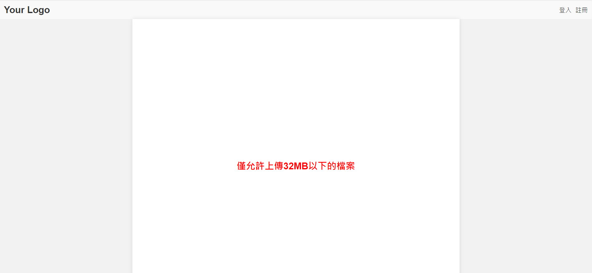

# flask例外處理
## 前言
上次我們介紹了完整的上傳檔案，至於今天我將介紹大家如何解決例外處裡像是檔案太大，這裡主要以兩種type介紹
1. HTTP 404 Not Found
2. HTTP 413 Request Entity Too Large

[完整code在這裡]()
## 範例
在 Flask 中，可以使用例外處理機制來處理不同類型的錯誤，
### 404 Not Found
 Flask 提供了 `@app.errorhandler` 裝飾器，可以用於定義錯誤處理函式。以下是一個示例：

```python
from flask import Flask, render_template

app = Flask(__name__)

@app.errorhandler(404)
def page_not_found(error):
    # 自訂錯誤處理邏輯
    errorMsg='此頁面不存在!'   
    return render_template('error.html',errorMsg=errorMsg), 404

if __name__ == '__main__':
    app.run(debug=True)
```

在上面的例子中，我們使用 `@app.errorhandler(404)` 裝飾器來定義了一個處理 404 Not Found 錯誤的函式 `page_not_found`。當 Flask 應用程式收到 404 錯誤時，會呼叫該函式進行處理。

在 `page_not_found` 函式中，我們可以根據需要執行一些自訂的邏輯來處理錯誤，例如返回一個自訂的錯誤頁面。在這個例子中，我們使用 `render_template` 函式來渲染一個名為 `error.html` 的 HTML 模板，並將 HTTP 狀態碼設定為 404，且傳遞`此頁面不存在!`給html 。

### 413 Request Entity Too Large
當使用者上傳的檔案大小超過伺服器所允許的上限時，可能會引發 HTTP 413 Request Entity Too Large 錯誤。在 Flask 中，你可以使用 `@app.errorhandler` 裝飾器來處理這個錯誤。以下是一個示例：

```python
from flask import Flask, render_template

app = Flask(__name__)
app.config['MAX_CONTENT_LENGTH'] = 32 * 1024 * 1024  # 32MB
@app.errorhandler(413)
def request_entity_too_large(error):
    # 自訂錯誤處理邏輯
    errorMsg='僅允許上傳32MB以下的檔案'    
    return render_template('error.html',errorMsg=errorMsg), 413

if __name__ == '__main__':
    app.run(debug=True)
```

在這個例子中，我們使用 `@app.errorhandler(413)` 裝飾器定義了一個處理 HTTP 413 Request Entity Too Large 錯誤的函式 `request_entity_too_large`。當 Flask 應用程式收到 413 錯誤時，會呼叫該函式進行處理。
預設情況下，Flask 的檔案上限是 16MB（即 16 * 1024 * 1024 bytes）。如果要調整這個上限，可以設定 MAX_CONTENT_LENGTH 配置項，其值為檔案大小的字節數。
而 `request_entity_too_large` 函式中，我們可以根據需要執行一些自訂的邏輯來處理錯誤，例如返回一個自訂的錯誤頁面。在這個例子中，我們使用 `render_template` 函式來渲染一個名為 `error.html` 的 HTML 模板，並將 HTTP 狀態碼設定為 413，且傳遞`僅允許上傳32MB以下的檔案`給html 。

## 結果
### 404

### 413


## 總結
今天我們介紹了例外處理，接下來會為大家介紹一系列的登入、註冊功能。